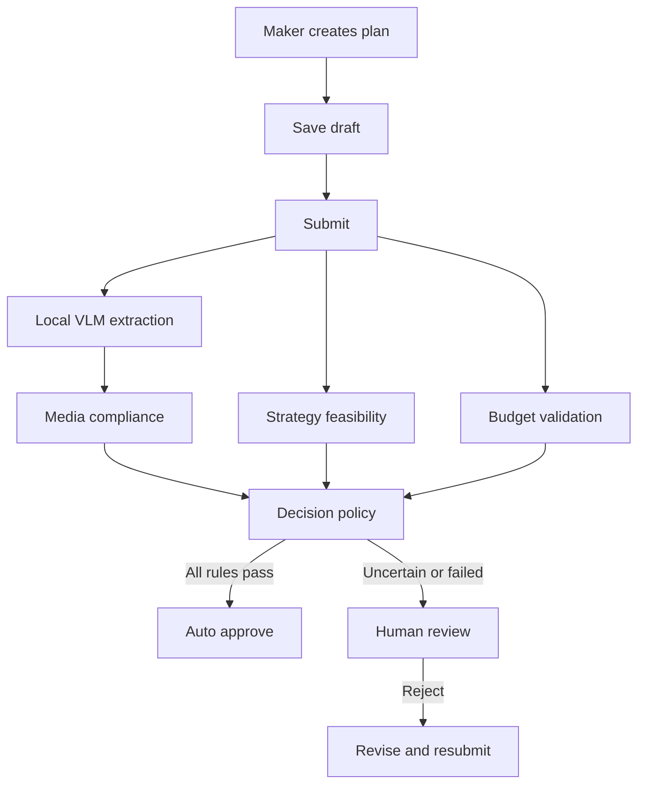

# OrganizationAI – Marketing Plan Approval

OrganizationAI is a Sprint 1 MVP for approving marketing plans through a controlled **Maker–AI–Checker** workflow. Local visual processing and specialized evaluation components support approval while deterministic rules and human review retain control over uncertain or high-risk cases.

## Sprint 1 objective

Deliver a runnable end-to-end flow within 72 hours:



## Core capabilities

- Create, save and submit marketing plans.
- Upload and preserve versioned campaign media.
- Extract visual content through a Local VLM adapter.
- Evaluate media compliance against policy.
- Score marketing-strategy feasibility with evidence and confidence.
- Validate budget against deterministic limits.
- Auto-approve only when every configured rule passes.
- Route uncertain, invalid or failed AI results to a Checker.
- Approve, reject, revise and resubmit without losing history.
- Preserve auditable model, policy, evidence and decision metadata.

## Auto-approval policy

The default policy requires all conditions below:

```text
media_result = PASS
AND media_confidence >= 0.85
AND feasibility_score > 70
AND feasibility_confidence >= 0.80
AND budget <= applicable_budget_limit
AND hard_violation_count = 0
AND unresolved_conflict_count = 0
AND agent_error_count = 0
AND auto_approval_policy_enabled = true
AND plan_status = PENDING_APPROVAL
AND approval_round_status = ACTIVE
```

All other cases require Human Review. Sprint 1 does not automatically reject a plan based solely on AI output.

## Documentation

- `AGENTS.md` – mandatory rules for Codex and other coding agents.
- `docs/scope-phe-duyet-ke-hoach-marketing-phase-1.md` – authoritative business scope and rules.
- `docs/chien-luoc-codex-sprint-1-72h.md` – implementation strategy, timeline and tests.

## Recommended repository structure

The actual structure must follow the existing repository. If this is a new repository, use the following as a target without forcing unnecessary layers:

```text
OrganizationAI/
├── AGENTS.md
├── README.md
├── docs/
│   ├── scope-phe-duyet-ke-hoach-marketing-phase-1.md
│   └── chien-luoc-codex-sprint-1-72h.md
├── .agents/
│   └── skills/
├── frontend/                 # if separated by the selected stack
├── backend/                  # if separated by the selected stack
├── tests/
└── scripts/
```

Recommended application modules:

```text
application/
├── plan-module/
├── approval-module/
├── ai-orchestrator/
│   ├── vlm-adapter/
│   ├── media-compliance/
│   ├── strategy-feasibility/
│   ├── budget-validator/
│   └── decision-policy/
├── audit-module/
├── notification-module/
└── shared/
```

## Main actors

| Actor | Responsibility |
|---|---|
| Maker | Creates, edits, submits and resubmits their plans |
| Checker | Reviews assigned plans that require a human decision |
| Administrator | Manages approval, budget and AI-policy configuration |
| Approval Orchestrator | Runs and validates the AI evaluation pipeline |
| Local VLM | Extracts OCR, image description, objects, quality and evidence |
| Media Compliance Agent | Evaluates media against policy |
| Strategy Feasibility Agent | Scores feasibility with confidence and assumptions |
| Budget Rules Engine | Deterministically validates the budget limit |
| Decision Policy Engine | Auto-approves or routes to Human Review |

## Plan states

Business states remain intentionally small:

- `DRAFT`
- `PENDING_APPROVAL`
- `APPROVED`
- `REJECTED`

Internal AI processing stages:

- `AI_PENDING`
- `AI_PROCESSING`
- `HUMAN_REVIEW_REQUIRED`
- `AI_AUTO_APPROVED`
- `AI_PROCESSING_FAILED`

## Local VLM resilience

Business logic must depend on a provider interface rather than one model implementation:

```text
VisualModelProvider
├── analyzeImage()
├── healthCheck()
└── getModelMetadata()
```

Sprint 1 requires:

- `LocalVLMProvider` for real local inference.
- `MockVLMProvider` for deterministic demo and automated tests.

The mock provider must support PASS, REVIEW_REQUIRED and timeout/error scenarios.

## Getting started

Use the verified PowerShell commands in [Demo tích hợp Role 1 – Backend – Role 3](#demo-tích-hợp-role-1--backend--role-3) below. Verified runtimes: Python 3.13.14 and Node.js 24.17.0; package managers: pip and npm; database: SQLite. The HTTP demo uses an explicitly configured mock model.

### WP3 core approval workflow (Python application service)

WP3 provides `ApprovalWorkflow` in `src/backend/application/workflow.py` and
`ApprovalRepository` in `src/backend/repositories/approval.py`. It uses the existing
Python dependencies in `requirements.txt` and standard-library SQLite. Constructing
the repository applies its repeatable `migration_001.sql` to the selected database;
the `wp3_` tables coexist with the WP2 snapshot store. Close each repository after
use and give each concurrent worker its own connection.

The host must authenticate users and provide a trusted principal/role directory,
an `ApprovalConfiguration`, and a registered evaluator identity. Actor IDs and roles
must never be accepted directly from public request bodies. The semantic boundary
supports `save_draft`, `upload_attachment`, `submit_plan`, `evaluate_round`,
`decide_round`, `get_plan`, and `get_verify_observation`; it does not add an HTTP
server, frontend, or model provider. Draft saves replace the complete payload and
preserve attachments. Upload accepts private bytes for configured PNG, JPEG or
WebP media, checks signature/size, and computes the manifest hash server-side.

Mutations require a stable idempotency key, correlation ID, and expected revision.
Draft/upload/submit use the plan revision; evaluate/decide use the round revision.
Submit/evaluate additionally check the expected policy version. Submission commits
the immutable version, configuration and one evaluation ticket before any pipeline
work. The pipeline must use that ticket's evaluation/run/provider/correlation IDs
when returning structured output to `evaluate_round`. The provider identity defaults
to explicit `MOCK_VLM`; there is no simulated model success in the service. Invalid
or failed evidence is normalized by WP2 and routed to Human Review. Replaying the
same successful intent returns its original response; a different input with the
same key conflicts. A second evaluation under a new key conflicts; manual pipeline
retry scheduling and notifications are outside this core package.

Human approval/rejection requires the assigned Checker, with rejection and override
reasons enforced by WP2. Rejection permits revision/resubmission; final decisions
and prior history remain immutable. Stop/undo and a separate request-changes action
are not exposed because the frozen contracts define only human APPROVED/REJECTED
and prohibit reopening final rounds. Revision requests use rejection with a reason.
Evaluation audit events describe receipt/validation of structured evidence at the
application boundary, not execution of a VLM. `get_verify_observation` returns
persisted records for a future Verify runner without computing a synthetic pass.

Verified Windows PowerShell test commands, using the repository's existing `.venv`:

```powershell
& '.\.venv\Scripts\python.exe' -m pytest -q tests/integration/test_approval_workflow.py
& '.\.venv\Scripts\python.exe' -m pytest -q
```

These tests cover draft/submit, both engine outcomes, all three escalation categories,
Checker decisions, resubmission, immutable history, restart/replay, independent
SQLite connections racing to submit/decide, and injected audit failures with rollback.
No formatter, lint, build or type-check configuration is currently present at the
repository root; WP3 introduces no additional tooling.

## Seeded demo scenarios

The completed Sprint must provide:

1. **Auto approval:** compliant media, feasibility above 70, sufficient confidence and budget within limit.
2. **Human review:** low confidence, warning, rule conflict or budget issue.
3. **Reject and resubmit:** Checker rejects; Maker submits a new version and approval round.
4. **Pipeline failure:** provider timeout/error routes to Human Review without rolling back submission.

## Minimum data model

```text
users
marketing_plans
marketing_plan_versions
attachments
approval_rounds
approval_decisions
ai_evaluation_runs
agent_executions
media_evaluation_results
strategy_evaluation_results
budget_validation_results
auto_approval_policies
budget_limits
activity_logs
notifications
```

## Critical safety and integrity rules

- A Maker cannot decide their own plan.
- Submitted content and attachments are immutable.
- Only one approval round is active at a time.
- Decisions are idempotent and concurrency-safe.
- Previous versions and AI results are never overwritten.
- AI failures route to Human Review.
- Budget decisions are deterministic.
- External model use is prohibited unless explicitly configured and approved.
- Significant business and AI actions are auditable.

## 72-hour checkpoints

| Time | Required outcome |
|---|---|
| Hour 20 | Maker can create and save a plan |
| Hour 28 | Submission creates Version 1 and Approval Round 1 |
| Hour 48 | AI pipeline returns Auto Approve or Human Review |
| Hour 62 | Maker → AI → Checker → Maker works end-to-end |
| Hour 68 | Scope freezes; only stabilization and demo preparation remain |
| Hour 72 | Runnable demo, tests, seed data and verified README |

## Development workflow

1. Read `AGENTS.md` and all authoritative docs.
2. Audit the repository before changing code.
3. Implement in small vertical work packages.
4. Run relevant tests after every work package.
5. Report changed files, commands, results, assumptions and limitations.
6. Freeze new feature work after Hour 68.

## Sprint 1 completion criteria

Sprint 1 is complete when:

- The four seeded demo scenarios run reliably.
- Critical business rules have automated coverage.
- The app can be started from documented commands.
- A submitted plan can be traced through every AI and human decision.
- Failed or uncertain AI processing never produces an unreviewed rejection.
- Build, lint/type checks and relevant tests succeed, or a known pre-existing blocker is explicitly documented.

### WP5 frontend and Verify harness

Install dependencies, then start the demo UI:

```powershell
& '.\.venv\Scripts\python.exe' -m pip install -r requirements.txt
& '.\.venv\Scripts\python.exe' -m streamlit run app.py
```

The Verify page runs five TEST_ONLY fixtures through the real WP3/WP4 workflow. Automated tests use MockVLMProvider and do not require an API key.

## Demo tích hợp Role 1 – Backend – Role 3

Backend FastAPI/SQLite và React/Vite đã nối bằng API thật. AI dùng mock công khai
cho dữ liệu tổng hợp; không dùng cho quyết định sản xuất. Chạy tại repository root:

```powershell
& ./.venv/Scripts/python.exe -m pip install -r requirements.txt
$env:APP_ENV = 'demo'
$env:DEMO_DATABASE = 'runtime/demo-organization.sqlite3'
$env:CORS_ORIGINS = 'http://127.0.0.1:5173,http://localhost:5173'
& ./.venv/Scripts/python.exe -m src.backend.seed_demo
& ./.venv/Scripts/python.exe -m uvicorn src.backend.api.app:app --host 127.0.0.1 --port 8010
```

Trong terminal thứ hai, từ `frontend/`:

```powershell
npm install
$env:VITE_API_BASE_URL = 'http://127.0.0.1:8010/api'
npm run dev -- --host 127.0.0.1 --port 5173 --strictPort
```

Frontend: http://127.0.0.1:5173. Backend health: http://127.0.0.1:8010/api/health.
OpenAPI: http://127.0.0.1:8010/docs và http://127.0.0.1:8010/openapi.json.
Repository constructor áp dụng migration_001.sql lặp lại an toàn; seed không xóa
DB/audit và chỉ nhận APP_ENV=demo với tên database demo-*.sqlite3.

Chọn actor trên header: DEMO-MAKER-01, DEMO-CHECKER-01, DEMO-ADMIN-01 hoặc
DEMO-DUAL-01. Roles/assignment do server quyết định; admin không có quyền đọc mọi
plan mặc định. Actor demo là cơ chế mô phỏng, không phải đăng nhập production.
Ngoài APP_ENV=demo, mọi demo-auth request bị từ chối.

Backend đọc environment của tiến trình, không tự nạp `.env`. Xem `.env.example` và
`frontend/.env.example` cho giá trị an toàn; file mẫu frontend dùng http://127.0.0.1:8010/api, khớp lệnh demo. Giá trị fallback trong API client khi không đặt VITE_API_BASE_URL là
http://127.0.0.1:8000/api; lệnh trên đặt rõ cổng 8010 vì cổng 8000 đang được tiến trình khác sử dụng. DEMO_MOCK_MODE nhận pass/review/timeout/error/malformed;
seed có thêm factual-conflict scenario riêng. Dữ liệu HTTP demo và fixture Role 1
có policy/version riêng; hạn mức 100 triệu VND chỉ là tổng hợp.

Kiểm thử tại root:

```powershell
& ./.venv/Scripts/python.exe -m pytest -q
& ./.venv/Scripts/python.exe -m src.verify.runner --suite ground-truth --output runtime/role1-ground-truth-actual.json
& ./.venv/Scripts/python.exe -m src.verify.runner --suite verify --output runtime/role1-verify-actual.json
```

Tại `frontend/`:

```powershell
npm run test
npm run build
npx playwright install chromium
npm run test:e2e
```

E2E tự chạy backend :8008/frontend :5178 và một database demo riêng, dùng Chromium
riêng. Không cần chạy server demo trước E2E. Kết quả và screenshot ở frontend/test-results/;
actual Verify ở runtime/, không ghi đè expected. Các thư mục này không commit.

Giới hạn: production auth/real VLM chưa triển khai trong integration này; không
external inference, Stop/Undo, auto-reject hay retry evaluation đã commit. Nếu đã
submit nhưng chưa evaluate, trang chi tiết cho tiếp tục cùng round. Danh sách UI
hiện tải 100 hồ sơ đầu; API có pagination. Verify UI giữ run trong phiên trang,
CLI ghi báo cáo actual riêng.

Tài liệu tích hợp:

- [Báo cáo cuối](docs/integration/role1-role3-integration-report.md)
- [Mapping](docs/integration/role1-contract-mapping.md)
- [Khác biệt và quyết định mở](docs/integration/role1-conflict-report.md)
- [Frontend/API](docs/integration/frontend-backend-gap-analysis.md)
- [API examples](docs/integration/api-examples.md)
