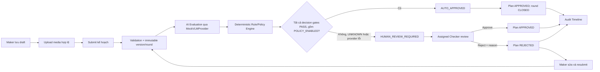
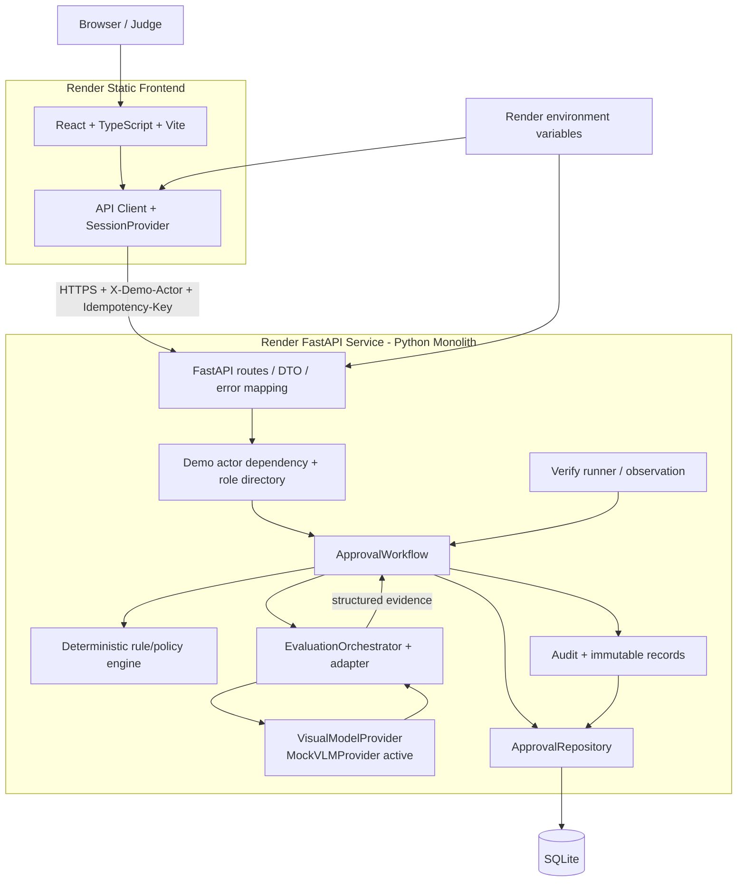

# 🏢 OrganizationAI – AI-Assisted Marketing Plan Approval


> OrganizationAI là Sprint 1 Judge Demo hỗ trợ Maker tạo và gửi kế hoạch marketing, dùng AI evaluation để tạo evidence, sau đó áp dụng rule/policy engine tất định để tự động phê duyệt hoặc chuyển hồ sơ cho Checker thẩm định thủ công.

Hệ thống hướng đến quy trình phê duyệt có kiểm soát, lưu lại version, approval round, evaluation, quyết định và audit event. Bản tích hợp HTTP hiện dùng `MockVLMProvider` với dữ liệu tổng hợp; đây không phải hệ thống đăng nhập, AI hay hạ tầng production.

---

## 🌐 Demo Trực Tuyến

| Thành phần | URL | Trạng thái/Mục đích |
| --- | --- | --- |
| Frontend Demo | [https://organizationai-frontend.onrender.com](https://organizationai-frontend.onrender.com) | Giao diện Sprint 1 Judge Demo |
| Backend API | [https://organizationai-api.onrender.com](https://organizationai-api.onrender.com) | FastAPI service |
| Health Check | [https://organizationai-api.onrender.com/api/health](https://organizationai-api.onrender.com/api/health) | Kiểm tra liveness của server |
| Swagger | [https://organizationai-api.onrender.com/docs](https://organizationai-api.onrender.com/docs) | Interactive API documentation của FastAPI |

Các URL trên đã trả về HTTP `200` ngày **2026-09-22**. Frontend bundle cũng được xác minh đang trỏ tới `https://organizationai-api.onrender.com/api`. Commit/hash đang chạy trên Render và mức độ đồng bộ với working tree hiện tại: **TBD** vì repository không chứa metadata từ Render Dashboard.

> [!NOTE]
> Render Free có thể cần khoảng 30–60 giây để khởi động sau thời gian không hoạt động. Đây là Judge Demo, không phải trạng thái production-ready.

Backend Render lưu SQLite tại `/tmp/organizationai/demo-organization.sqlite3`. Dữ liệu người dùng có thể mất sau restart, redeploy hoặc spin-down; startup chỉ khôi phục tám scenario seed tất định (`AUTO`, `BUDGET`, `REVIEW`, `TIMEOUT`, `FACTS`, `DRAFT`, `APPROVED`, `REJECTED`).

---

## 🌟 Tính Năng Nổi Bật

| Trạng thái | Khả năng | Phạm vi thực tế trong repository |
| --- | --- | --- |
| `Implemented` | Quản lý kế hoạch | Lưu draft chưa đầy đủ, cập nhật draft/rejected plan, upload PNG/JPEG/WebP, gửi duyệt và xem danh sách/chi tiết |
| `Implemented` | Version và approval round | Submit tạo snapshot bất biến, version và round mới; rejected plan có thể sửa rồi resubmit |
| `Implemented` | Rule/Policy Evaluation | 13 decision gates kiểm tra integrity, evidence, confidence, budget, authority, policy và trạng thái |
| `Implemented` | Human Review | Queue cho Checker được gán; hỗ trợ `APPROVED`/`REJECTED`, reason, override reason và stale-revision handling |
| `Implemented` | Audit và truy vết | Timeline actor, trạng thái trước/sau, policy/model/version/round, decision và correlation metadata |
| `Implemented` | Policy view | Màn hình chỉ đọc từ `/api/config`; không có API chỉnh policy trong Sprint 1 |
| `Implemented` | Verify dashboard | Chạy suite `general` 5 case và `escalation` 15 regression qua workflow thật, không hard-code PASS |
| `Implemented` | Demo seed | Tám scenario tổng hợp, seed idempotent và không xóa database hiện có |
| `Demo/Mock` | Actor identity | Chọn shared demo actor, gửi qua header `X-Demo-Actor`; server vẫn kiểm tra role và ownership |
| `Demo/Mock` | AI evaluation | FastAPI đang nối `MockVLMProvider`; timeout/error/malformed evidence đều fail closed sang Human Review |
| `Implemented (local)` | Auth workflow | Cookie JWT xác thực Maker/Checker; PostgreSQL lưu kế hoạch, snapshot, provider evaluation, quyết định policy và audit; AI lỗi chuyển Checker review |
| `Planned/TBD` | Production identity và AI | Auth workflow chưa dành cho production; chưa có Local VLM inference transport, nguồn policy/budget/authority đã phê duyệt hoặc rate limiting toàn diện |

AI không tự động từ chối kế hoạch. Engine chỉ trả `AUTO_APPROVED` hoặc `HUMAN_REVIEW_REQUIRED`; quyết định `REJECTED` chỉ do Checker được gán thực hiện. Policy mặc định cho submission HTTP mới là `DEMO-HTTP-2` với auto-approval tắt, nên mock PASS vẫn chuyển Checker; riêng seed `DEMO-SEED-AUTO` dùng snapshot `DEMO-HTTP-AUTO-1` để minh họa controlled auto-approval.

---

## 🔄 Quy Trình Xét Duyệt


```mermaid
flowchart LR
    A["Maker lưu draft"] --> B["Upload media hợp lệ"]
    B --> C["Submit kế hoạch"]
    C --> D["Validation + immutable version/round"]
    D --> E["AI Evaluation qua MockVLMProvider"]
    E --> F["Deterministic Rule/Policy Engine"]
    F --> G{"Tất cả decision gates PASS, gồm POLICY_ENABLED?"}
    G -->|Có| H["AUTO_APPROVED"]
    H --> I["Plan APPROVED; round CLOSED"]
    G -->|Không, UNKNOWN hoặc provider lỗi| J["HUMAN_REVIEW_REQUIRED"]
    J --> K["Assigned Checker review"]
    K -->|Approve| L["Plan APPROVED"]
    K -->|Reject + reason| M["Plan REJECTED"]
    M --> N["Maker sửa và resubmit"]
    N --> D
    I --> O["Audit Timeline"]
    L --> O
    M --> O
```

Submit được commit trước khi evaluation chạy. Vì vậy provider timeout hoặc evidence không hợp lệ không làm mất bản nộp; hồ sơ được chuyển sang Human Review cùng dấu vết audit.

---

## 🏛️ Kiến Trúc Hệ Thống


```mermaid
flowchart TB
    U["Browser / Judge"]

    subgraph RF["Render Static Frontend"]
        FE["React + TypeScript + Vite"]
        CLIENT["API Client + SessionProvider"]
        FE --> CLIENT
    end

    subgraph RB["Render FastAPI Service - Python Monolith"]
        API["FastAPI routes / DTO / error mapping"]
        AUTH["Demo actor dependency + role directory"]
        WF["ApprovalWorkflow"]
        RULES["Deterministic rule/policy engine"]
        PIPE["EvaluationOrchestrator + adapter"]
        PROVIDER["VisualModelProvider<br/>MockVLMProvider active"]
        REPO["ApprovalRepository"]
        VERIFY["Verify runner / observation"]
        AUDIT["Audit + immutable records"]

        API --> AUTH
        AUTH --> WF
        WF --> PIPE
        PIPE --> PROVIDER
        PROVIDER --> PIPE
        PIPE -->|structured evidence| WF
        WF --> RULES
        WF --> REPO
        WF --> AUDIT
        VERIFY --> WF
        AUDIT --> REPO
    end

    DB[("SQLite")]
    ENV["Render environment variables"]

    U --> FE
    CLIENT -->|"HTTPS + X-Demo-Actor + Idempotency-Key"| API
    REPO --> DB
    ENV --> CLIENT
    ENV --> API
```

| Lớp | Trách nhiệm |
| --- | --- |
| Frontend | Điều hướng, form, queue, result, policy, audit và Verify UI; không tự tính business outcome |
| HTTP transport | FastAPI routes, Pydantic DTO, CORS, demo actor dependency và error response thống nhất |
| Application | `ApprovalWorkflow` điều phối authorization, revision, idempotency, version/round và transaction |
| AI pipeline | Provider interface, timeout/retry hữu hạn, evidence validation và adapter vào workflow |
| Decision engine | Tính decision tất định từ snapshot, policy, budget, authority và evidence đã chuẩn hóa |
| Persistence | `ApprovalRepository` dùng SQLite, migration lặp lại an toàn, append-only records và audit |
| Verify | Chạy fixture qua workflow thật rồi mới so sánh actual với expected |

Ứng dụng backend là một Python monolith theo lớp, không phải kiến trúc microservice. `app.py`/Streamlit vẫn tồn tại như local legacy demo riêng, không phải frontend được deploy bởi `render.yaml`.

---

## 🧰 Công Nghệ Sử Dụng

| Lớp | Công nghệ | Mục đích |
| --- | --- | --- |
| Frontend | React, TypeScript, Vite, React Router | Giao diện Judge Demo và API-backed workflow |
| Backend | FastAPI, Uvicorn, Python | REST API, DTO, authorization dependency và application workflow |
| AI pipeline | Python provider interface, deterministic mock provider | Tạo/kiểm tra evidence và mô phỏng các trạng thái AI trong demo |
| Database | SQLite + PostgreSQL | SQLite giữ Judge Demo; PostgreSQL lưu tài khoản Auth và Auth workflow |
| Testing | Pytest, Vitest, Testing Library, Playwright | Unit, integration, frontend và browser E2E |
| Deployment | Render Blueprint | Static frontend và Python web service riêng biệt |

Judge Demo công khai trên Render vẫn dùng cấu hình Render; Docker Compose chạy Judge Demo local cùng Auth PostgreSQL riêng.

---

## 📁 Cấu Trúc Thư Mục Dự Án

```text
OrganizationAI/
├── frontend/                  # React/TypeScript/Vite UI, Vitest và Playwright
├── src/
│   ├── backend/
│   │   ├── api/               # FastAPI routes, dependencies, DTO và errors
│   │   ├── application/       # ApprovalWorkflow
│   │   ├── domain/            # Models và policy snapshots
│   │   ├── repositories/      # SQLite repository và migration_001.sql
│   │   └── rules/             # Deterministic decision engine
│   ├── ai_pipeline/           # Provider, orchestrator, validation và adapter
│   ├── verify/                # Verify runner, BA adapter và observation checks
│   └── shared/                # Validation/hash dùng chung
├── tests/                     # Unit, integration, fixtures BA và synthetic media
├── docs/                      # Scope, contracts, BA/policy và integration reports
├── deployment/                # Render launcher, validation scripts và deployment runbook
├── app.py                     # Legacy Streamlit local demo
├── render.yaml                # Render Blueprint cho frontend/backend
├── requirements.txt           # Python dependencies
├── .env.example               # Backend demo environment template
└── README.md
```

Repository hiện không có thư mục `data/` được Git theo dõi. Fixture nằm trong `tests/fixtures/`; database và report phát sinh nằm trong `runtime/` (được ignore), còn Render dùng `/tmp/organizationai/`.

---

## 🚀 Cài Đặt Và Chạy Local

### 1. Yêu cầu hệ thống

| Thành phần | Khuyến nghị theo repository |
| --- | --- |
| Git | Bản hiện hành |
| Python | `3.13.14` để đồng nhất với `render.yaml` |
| Node.js | `24.17.0` để đồng nhất với `render.yaml` |
| npm | Đi kèm Node.js |
| Trình duyệt E2E | Chromium do Playwright quản lý, chỉ cần khi chạy E2E |

### 2. Clone và chuẩn bị backend

```powershell
git clone https://github.com/bikhoa142007-hash/OrganizationAI.git
Set-Location OrganizationAI

py -3.13 -m venv .venv
& .\.venv\Scripts\Activate.ps1
python -m pip install -r requirements.txt

Copy-Item .env.example .env
```

Backend không tự động nạp file `.env`. Hãy đặt các biến tương ứng trong terminal chạy server:

```powershell
$env:APP_ENV = 'demo'
$env:DEMO_DATABASE = 'runtime/demo-organization.sqlite3'
$env:DEMO_MOCK_MODE = 'pass'
$env:CORS_ORIGINS = 'http://127.0.0.1:5173,http://localhost:5173'

python -m src.backend.seed_demo
python -m uvicorn src.backend.api.app:app --host 127.0.0.1 --port 8010
```

Seed chỉ chạy khi `APP_ENV=demo` và database có tên `demo-*.sqlite3`. Repository constructor tự áp dụng `migration_001.sql`.

### 3. Chuẩn bị frontend

Mở terminal PowerShell thứ hai:

```powershell
Set-Location OrganizationAI\frontend
npm install
Copy-Item .env.example .env
npm run dev -- --host 127.0.0.1 --port 5173 --strictPort
```

### 4. URL local

| Thành phần | URL |
| --- | --- |
| Frontend | [http://127.0.0.1:5173](http://127.0.0.1:5173) |
| Backend health | [http://127.0.0.1:8010/api/health](http://127.0.0.1:8010/api/health) |
| Swagger | [http://127.0.0.1:8010/docs](http://127.0.0.1:8010/docs) |
| OpenAPI JSON | [http://127.0.0.1:8010/openapi.json](http://127.0.0.1:8010/openapi.json) |

---

## 🔐 Auth cục bộ với PostgreSQL và Docker Compose

Auth dùng PostgreSQL riêng cho tài khoản và role. Judge Demo tiếp tục dùng SQLite cùng `X-Demo-Actor`; cookie Auth không biến tài khoản PostgreSQL thành actor demo. Docker Compose chạy các route demo hiện có cùng Auth cục bộ, còn Judge Demo công khai trên Render vẫn theo cấu hình Render.

1. Sao chép `.env.example` thành `.env`; đặt các giá trị local riêng cho `POSTGRES_PASSWORD`, `JWT_SECRET` (ít nhất 32 byte ngẫu nhiên) và `AUTH_SEED_PASSWORD`. `DATABASE_URL` trong container dùng hostname `db` và port `5432`; PostgreSQL được mở trên host tại port `5433`. Không commit `.env`.
2. Chạy stack local:

   ```powershell
   docker compose up --build
   ```

   Compose chờ PostgreSQL healthy, chạy `alembic upgrade head`, seed tài khoản demo rồi khởi động FastAPI và Vite.

3. Dùng giao diện tại `/login`, `/register` và `/account`. Luồng Judge Demo vẫn bắt đầu tại `/` và giữ bộ chọn demo actor.

| Thành phần | URL local |
| --- | --- |
| Frontend | `http://localhost:5173` |
| FastAPI | `http://localhost:8010` |
| API docs | `http://localhost:8010/docs` |
| PostgreSQL host port | `localhost:5433` |

`POST /api/auth/register` nhận username, email hoặc số điện thoại quốc tế, và mật khẩu; tài khoản tự đăng ký chỉ nhận role `MAKER` và sau khi tạo sẽ được chuyển tới đăng nhập. `POST /api/auth/login` nhận username, user code hoặc email và đặt JWT vào cookie `HttpOnly`, `SameSite=Lax`. `GET /api/auth/me` trả hồ sơ và role đã nạp từ PostgreSQL; `POST /api/auth/logout` xóa cookie. Ghi nhớ trên thiết bị này dùng thời hạn `AUTH_REMEMBER_TOKEN_DAYS`; phiên thường dùng `JWT_ACCESS_TOKEN_MINUTES`.

Self-registration mặc định chỉ bật trong Compose local. Cookie dùng `AUTH_COOKIE_SECURE=false` cho HTTP localhost; môi trường HTTPS cần bật `AUTH_COOKIE_SECURE=true`. Không dùng `AUTH_SEED_PASSWORD` hoặc bật self-registration trên Judge Demo production. Các tài khoản seed local dùng username `maker`, `checker` và `admin`, cùng mật khẩu local trong `AUTH_SEED_PASSWORD`; seed không ghi đè mật khẩu hoặc trạng thái tài khoản hiện có.

Chạy lại migration hoặc seed trong container:

```powershell
docker compose exec backend alembic upgrade head
docker compose exec backend python -m src.backend.seed_auth
```

Đăng nhập Maker sẽ mở workflow tại `/workflow/plans`; Checker xem `/workflow/reviews`. Các trang này dùng JWT cookie và route `/api/workflow/*`, không gửi `X-Demo-Actor`. `/api/plans`, `/api/reviews`, Verify và các trang demo vẫn dùng SQLite cùng actor header riêng.

Auth workflow gọi pipeline AI hiện có sau khi đã commit snapshot/version/round trong PostgreSQL; evaluation và quyết định tất định được lưu theo từng round. Mặc định chọn Local VLM adapter nhưng chưa có inference transport trong repository nên sẽ fail closed sang `HUMAN_REVIEW_REQUIRED`. Có thể chọn `MOCK_VLM` rõ ràng trong Compose local để demo các kịch bản pass/review/timeout/error/schema; Mock chỉ được phép khi `APP_ENV=demo`. Policy mặc định của Auth workflow tắt auto-approval vì chưa có cấu hình budget/authority/policy được phê duyệt cho tài khoản thật. Không dùng cấu hình demo để quyết định tài khoản Auth. Migration `20260929_04_authenticated_ai_pipeline` bổ sung persistence cho run/evaluation/engine decision, không chuyển đổi hay xóa SQLite. Database `runtime/demo-organization.sqlite3` tiếp tục riêng cho Judge Demo.

Để chạy mô phỏng tường minh trong Compose local, đặt `AUTH_WORKFLOW_AI_PROVIDER=MOCK_VLM` và `AUTH_WORKFLOW_MOCK_SCENARIO=pass` (hoặc `review`, `timeout`, `error`, `malformed`, `unknown_media`) trong `.env`. Mock pass vẫn vào Checker review khi dùng Auth policy mặc định; auto-approval chỉ bật với một `ApprovalConfiguration` đã được ứng dụng phê duyệt và inject vào workflow.

Sau khi Compose khởi động và seed PostgreSQL, chạy smoke test với tài khoản `maker`, `checker`, `admin`:

```powershell
& .\.venv\Scripts\python.exe scripts/smoke_auth_workflow.py
```

Script hỏi mật khẩu seed và API base URL, tạo ba kế hoạch có ảnh riêng tư, thử approve, reject và hai quyết định đồng thời trên cùng round; script cũng xác nhận các quyền bị chặn và cookie Auth không thay thế `X-Demo-Actor`. Các bản ghi smoke có tên và ID riêng; xóa dữ liệu sau kiểm thử chỉ khi đã kiểm tra các ID đó.

## ☁️ Sử Dụng Và Cập Nhật Server Render

`render.yaml` khai báo hai service riêng:

- `organizationai-api`: Python/FastAPI web service.
- `organizationai-frontend`: React/Vite static site.

`autoDeployTrigger` đang là `off`. Sau khi merge vào branch được cấu hình trong Render Dashboard (tên branch: **TBD**):

1. Deploy backend trước nếu backend và frontend cùng thay đổi.
2. Mở `Deploys → Manual Deploy → Deploy latest commit`.
3. Chờ build/start hoàn tất rồi kiểm tra `/api/health`.
4. Deploy frontend bằng `Deploy latest commit`.
5. Nếu frontend vẫn dùng bundle/cache cũ, chọn `Clear build cache & deploy`.
6. Nhấn `Ctrl + F5` trên trình duyệt sau khi frontend hoàn tất.

Không chọn `Restart service` khi mục tiêu là lấy commit mới; restart chỉ khởi động lại deployment hiện có.

### Environment variables

| Biến | Service | Ý nghĩa |
| --- | --- | --- |
| `APP_ENV` | Backend | Phải là `demo` để cho phép shared demo actors và seed |
| `DEMO_DATABASE` | Backend | Render dùng `/tmp/organizationai/demo-organization.sqlite3` |
| `DEMO_MOCK_MODE` | Backend | Chế độ provider demo, Blueprint hiện đặt `pass` |
| `CORS_ORIGINS` | Backend | Một HTTPS frontend origin chính xác, không wildcard/path/trailing slash |
| `PYTHON_VERSION` | Backend build | Blueprint pin `3.13.14` |
| `VITE_API_BASE_URL` | Frontend build | Public API base URL, ví dụ `https://organizationai-api.onrender.com/api` |

`PORT` do Render cấp cho backend; `NODE_VERSION=24.17.0` cũng được khai báo trong Blueprint. Không đặt credential trong biến bắt đầu bằng `VITE_` vì chúng được đóng gói vào JavaScript công khai.

---

## 🔐 Demo Actors Và Phân Quyền

| Actor | Role | Quyền chính |
| --- | --- | --- |
| `DEMO-MAKER-01` | `MAKER` | Tạo/lưu draft, upload, submit, xem plan của mình, sửa và resubmit plan bị reject |
| `DEMO-CHECKER-01` | `CHECKER` | Xem plan được gán, mở review queue, approve/reject Human Review với reason phù hợp |
| `DEMO-ADMIN-01` | `ADMIN` | Đọc demo config/policy và chạy Verify; chưa có API quản trị policy hoặc quyền đọc mọi plan |
| `DEMO-DUAL-01` | `MAKER`, `CHECKER` | Có hai role, nhưng Checker action vẫn yêu cầu actor trùng `checker_id`; assignment demo hiện cố định về `DEMO-CHECKER-01` |

> Đây là cơ chế nhận diện actor phục vụ Judge Demo, không phải hệ thống đăng nhập production.

Actor được gửi qua header `X-Demo-Actor`, nhưng role directory, Maker ownership và Checker assignment do server quyết định. Actor lạ hoặc internal evaluator bị từ chối; Maker không được quyết định plan của mình; Checker không được gán và Admin không có global plan access. Frontend có role guard để điều hướng, còn backend vẫn là lớp kiểm tra quyền cuối cùng.

---

## 🧪 Kiểm Thử

### Backend, integration và Verify

Chạy tại repository root:

```powershell
& .\.venv\Scripts\python.exe -m pytest -q

& .\.venv\Scripts\python.exe -m src.verify.runner `
  --suite verify `
  --output runtime/ba-verify-actual.json

& .\.venv\Scripts\python.exe -m src.verify.runner `
  --suite ground-truth `
  --output runtime/ba-ground-truth-actual.json
```

### Frontend và browser E2E

Chạy trong `frontend/`:

```powershell
npm run test
npm run build
npx playwright install chromium
npm run test:e2e
```

E2E tự chạy backend tại `127.0.0.1:8008`, frontend tại `127.0.0.1:5178` và dùng database demo riêng. Cần tạo `.venv` ở repository root và bảo đảm hai cổng này đang trống.

### Kết quả xác minh trong phiên cập nhật README

| Kiểm tra | Kết quả ngày 2026-09-22 |
| --- | --- |
| Full Pytest | `179 passed`, `84 subtests passed` |
| Verify `verify` | `5/5` case passed |
| Verify `ground-truth` | `15/15` case passed |
| Vitest | `16/16` test passed trong `3` test files |
| Production build | TypeScript + Vite build thành công |
| Playwright E2E | Chưa hoàn tất: Chromium v1243 chưa có và CDN download timeout; không ghi số test pass |

### Kết quả xác minh Auth workflow ngày 2026-09-28

| Kiểm tra | Kết quả |
|---|---|
| Full backend Pytest | `215 passed`, `84 subtests passed`; 2 cảnh báo deprecation của Starlette/AnyIO |
| Vitest | `29 passed` trong 6 test files |
| Frontend production build | TypeScript và Vite build thành công |
| Judge Demo Verify | `5/5` case; escalation/ground-truth `15/15` case |
| Docker/PostgreSQL migration và smoke | Chưa chạy: Docker CLI/Desktop không khả dụng trong môi trường kiểm thử này |

### Kết quả tích hợp AI Auth workflow ngày 2026-09-29

| Kiểm tra | Kết quả |
|---|---|
| Full backend Pytest | `218 passed`, `84 subtests passed`; 2 cảnh báo deprecation Starlette/AnyIO |
| Auth API và migration tests | `12 passed` |
| Vitest | `31 passed` trong 7 test files |
| Frontend typecheck và production build | Thành công (`tsc -b`, Vite production build) |
| PostgreSQL migration | Đã chạy trên Compose PostgreSQL: `20260928_03 -> 20260929_04` |
| Auth HTTP smoke | Thành công: Maker submit, AI/engine persistence, Checker approve/reject, permission blocks và concurrent decision race; tạo 3 smoke plan tổng hợp trong local PostgreSQL |

### Local VLM trích xuất ảnh cho Auth workflow

`LocalVLMProvider` gửi ảnh riêng tư từ snapshot đã xác minh tới một endpoint OpenAI-compatible Chat Completions do operator cấu hình. Request dùng base64 `image_url` và JSON Schema response format; adapter chỉ yêu cầu OCR, quan sát trực tiếp và điều chưa đọc được. Server tự gắn attachment ID/hash, version, approval round, run ID và input hash. VLM không trả confidence, bounding box, quyết định duyệt hoặc điểm đánh giá.

Repository không chọn sẵn model ID hoặc runtime, và môi trường local hiện không có endpoint/model VLM cấu hình nên chưa chạy inference thật. `LOCAL_VLM_BASE_URL` để trống mặc định nhằm tránh gửi ảnh ra ngoài. Khi có extraction hợp lệ, Auth vẫn chuyển Checker vì Media Compliance và Strategy chưa có provider thật; media confidence và feasibility score giữ trống. Auto-approval Auth vẫn tắt theo cấu hình mặc định.

Thiết lập các biến sau trong `.env` (không commit file này):

| Biến | Ý nghĩa |
| --- | --- |
| `AUTH_WORKFLOW_AI_PROVIDER` | `LOCAL_VLM` mặc định; chỉ chọn `MOCK_VLM` rõ ràng cho demo |
| `LOCAL_VLM_MODEL` | Model ID do runtime đang chạy nhận diện; không phải revision bất biến |
| `LOCAL_VLM_BASE_URL` | Root URL, gồm `/v1`, của endpoint tương thích Chat Completions |
| `LOCAL_VLM_ALLOW_REMOTE` | Mặc định `false`; endpoint không-local cần bật rõ ràng và dùng HTTPS |
| `LOCAL_VLM_API_KEY` | Tùy chọn; chỉ truyền trong Authorization header ở backend |
| `LOCAL_VLM_TIMEOUT_SECONDS` | Timeout mỗi lần gọi, 1–45 giây; mặc định 30 |
| `LOCAL_VLM_MAX_OUTPUT_TOKENS` | Giới hạn output token, mặc định 1536 |
| `LOCAL_VLM_MAX_RESPONSE_BYTES` | Giới hạn response body, mặc định 262144 byte |
| `LOCAL_VLM_MAX_INPUT_BYTES` | Giới hạn tổng bytes ảnh mỗi request VLM, mặc định 20 MiB |

Với Docker Compose, không dùng `localhost` làm inference host vì địa chỉ đó trỏ tới backend container. Ví dụ Docker Desktop: `LOCAL_VLM_BASE_URL=http://host.docker.internal:8000/v1`; backend Compose có ánh xạ `host.docker.internal:host-gateway` cho Docker Engine trên Linux. Runtime trên host phải lắng nghe địa chỉ có thể truy cập từ container. Mặc định adapter chỉ cho phép loopback và `host.docker.internal`; host khác cần được duyệt rõ qua `LOCAL_VLM_ALLOW_REMOTE=true` và dùng HTTPS trước khi nhận ảnh riêng tư.

Khởi động Auth workflow và migration PostgreSQL bằng `docker compose up --build -d`. Sau khi model/runtime được chọn và chạy, đăng nhập bằng Maker, tạo kế hoạch có ảnh và mở chi tiết tại `/workflow/plans/{id}`. Mục “Trích xuất ảnh (VLM)” hiển thị OCR, quan sát, phần chưa đọc được và attachment hash; trạng thái đánh giá toàn bộ, Media Compliance, Strategy và Decision Engine hiển thị riêng. Với cấu hình hiện tại chưa có model/runtime, hệ thống ghi extraction lỗi đã làm sạch và chuyển Checker; không fallback sang Mock.

Endpoint phải hỗ trợ ảnh base64 trong Chat Completions cùng `response_format` kiểu `json_schema`; output được server kiểm tra lại. Đây là giao thức transport, không phải xác nhận một runtime cụ thể tương thích. Tài liệu giao thức chính thức: [image inputs](https://developers.openai.com/api/docs/guides/images-vision) và [structured outputs](https://developers.openai.com/api/docs/guides/structured-outputs). Cần xác minh runtime/model ID và chạy smoke test thật sau khi người vận hành cung cấp cấu hình.

---

## 🔌 API Chính

Judge Demo endpoint `/api/plans`, `/api/reviews` và `/api/verify` dùng riêng `X-Demo-Actor`; mutation demo yêu cầu `Idempotency-Key`. Auth workflow `/api/workflow/*` dùng JWT cookie, role từ PostgreSQL và không nhận maker ID/role từ body.

| Method | Endpoint | Actor/Permission | Mục đích |
| --- | --- | --- | --- |
| `GET` | `/api/health` | Public | Liveness và environment |
| `GET` | `/api/config` | Demo actor hợp lệ | Actor/role, policy snapshot, provider và capability flags |
| `GET` | `/api/plans` | Demo actor hợp lệ | Danh sách plan theo Maker ownership hoặc Checker assignment; hỗ trợ `offset`/`limit` |
| `PUT` | `/api/plans/{plan_id}/draft` | `MAKER`, chỉ plan của mình | Tạo hoặc cập nhật draft |
| `GET` | `/api/reviews` | `CHECKER` | Danh sách Human Review đang chờ và được gán cho Checker hiện tại |
| `GET` | `/api/plans/{plan_id}` | Owning Maker hoặc assigned Checker | Đọc plan, version, round, record và audit history |
| `POST` | `/api/plans/{plan_id}/attachments` | Owning `MAKER` | Upload private media bằng multipart |
| `GET` | `/api/plans/{plan_id}/attachments/{attachment_id}` | Actor có quyền đọc plan | Tải private attachment |
| `POST` | `/api/plans/{plan_id}/submit` | Owning `MAKER` | Khóa snapshot, tạo version/round và evaluation ticket |
| `POST` | `/api/plans/{plan_id}/rounds/{number}/evaluate` | Actor có quyền đọc plan | Chạy hoặc replay evaluation qua internal evaluator |
| `POST` | `/api/plans/{plan_id}/rounds/{number}/decision` | Assigned `CHECKER` | Ghi quyết định human `APPROVED`/`REJECTED` |
| `GET` | `/api/plans/{plan_id}/rounds/{number}/observation` | Actor có quyền đọc plan | Đọc persisted observation cho Verify/audit |
| `POST` | `/api/verify/{suite}` | Demo actor hợp lệ | Chạy suite `general` hoặc `escalation` trong in-memory workflow |
| `GET` | `/api/workflow/plans` | Auth cookie + `MAKER` | Danh sách kế hoạch mà Maker tạo |
| `GET` | `/api/workflow/checkers` | Auth cookie + `MAKER` | Checker đang hoạt động để giao kế hoạch |
| `POST` | `/api/workflow/plans` | Auth cookie + `MAKER` | Tạo draft; backend tự gán Maker |
| `PUT` | `/api/workflow/plans/{plan_id}` | Maker sở hữu, DRAFT/REJECTED | Cập nhật draft với optimistic revision |
| `POST` | `/api/workflow/plans/{plan_id}/attachments` | Maker sở hữu, DRAFT/REJECTED | Lưu ảnh riêng tư và SHA-256 trong PostgreSQL |
| `POST` | `/api/workflow/plans/{plan_id}/submit` | Maker sở hữu | Tạo version/round snapshot và chuyển sang Human Review |
| `GET` | `/api/workflow/reviews` | Auth cookie + `CHECKER` | Queue hồ sơ đang chờ, chỉ hồ sơ giao Checker hiện tại |
| `GET` | `/api/workflow/plans/{plan_id}` | Maker sở hữu hoặc Checker được giao | Nội dung, version và lịch sử Auth workflow |
| `POST` | `/api/workflow/plans/{plan_id}/rounds/{round}/decision` | Checker được giao | Phê duyệt/từ chối; từ chối cần lý do, một quyết định mỗi round |

Xem thêm [API examples](docs/integration/api-examples.md) và [generated OpenAPI snapshot](docs/integration/openapi.json).

---

## 👥 Thành Viên Thực Hiện

| Họ và tên | Vai trò | Trách nhiệm chính |
| --- | --- | --- |
| `[Bổ sung họ tên]` | `[Bổ sung vai trò]` | `[Bổ sung trách nhiệm]` |
| `[Bổ sung họ tên]` | `[Bổ sung vai trò]` | `[Bổ sung trách nhiệm]` |
| `[Bổ sung họ tên]` | `[Bổ sung vai trò]` | `[Bổ sung trách nhiệm]` |

---

## ⚠️ Giới Hạn Hiện Tại

- Shared demo actors có thể được bất kỳ người dùng demo nào chọn; chưa có production authentication/session management.
- FastAPI Judge Demo tiếp tục dùng `MockVLMProvider`. Auth Local VLM có transport OpenAI-compatible nhưng runtime/model chưa được chọn hoặc cấu hình; Media Compliance và Strategy provider thật còn thiếu nên Auth vẫn route Checker.
- SQLite phù hợp single-instance demo, không phù hợp horizontal scaling hoặc dữ liệu phê duyệt thật.
- Render Free dùng ephemeral `/tmp`; plan, attachment, audit và idempotency record có thể mất khi restart/redeploy/spin-down. Chỉ tám seed scenario được tạo lại.
- Render Free có cold start và có thể gián đoạn trong lúc deploy.
- Chưa có rate limiting toàn diện; `--limit-concurrency 32` chỉ giới hạn concurrency, không phải rate limit.
- Không có Stop/Undo hoặc action `request_changes` riêng; chỉnh sửa được thực hiện sau human rejection rồi resubmit.
- Policy UI chỉ đọc; chưa có API quản trị policy, user directory, notification hoặc SLA.
- UI list hiện lấy tối đa 100 plan đầu; Verify cache và UI run state không bền vững qua process/page session.
- Public URL đã reachable nhưng deployed commit/hash vẫn `TBD`; chưa tuyên bố public deployment khớp hoàn toàn với working tree hiện tại.

Phạm vi hiện tại chỉ phù hợp cho Sprint 1 Judge Demo và dữ liệu tổng hợp.

---

## 📚 Tài Liệu Liên Quan

| Tài liệu | Nội dung |
| --- | --- |
| [Deployment runbook](deployment/README.md) | Render provisioning, environment, verification, rollback và persistence limits |
| [BA – Backend – Frontend Developer integration report](docs/integration/ba-frontend-developer-integration-report.md) | Kiến trúc tích hợp, endpoint, seed, frontend và test handoff |
| [Frontend/backend gap analysis](docs/integration/frontend-backend-gap-analysis.md) | Mapping UI với backend contract |
| [Authenticated workflow on PostgreSQL](docs/integration/authenticated-workflow-postgresql.md) | Auth cookie, role checks, schema, SQLite retention and local smoke steps |
| [BA contract mapping](docs/integration/ba-contract-mapping.md) | Mapping dataset/business evidence vào workflow |
| [RBAC/workflow validation audit](docs/integration/rbac-workflow-validation-audit.md) | Kiểm tra quyền, validation, policy mode, seed và demo checklist |
| [API examples](docs/integration/api-examples.md) | Ví dụ request/response demo HTTP API |
| [Decision contract](docs/contracts/decision-contract.md) | Outcome, rule checks và invariant quyết định |
| [Evaluation contract](docs/contracts/evaluation-schema.md) | Schema evidence/evaluation |
| [Escalation contract](docs/contracts/escalation-question-schema.md) | Category và câu hỏi chuyển tiếp |
| [Audit event contract](docs/contracts/audit-event-schema.md) | Metadata và yêu cầu audit |
| [Verify result contract](docs/contracts/verify-result-schema.md) | Assertion và kết quả Verify |
| [Role 1 v2.1 index](docs/role1/v2.1/00-index.md) | Mục lục BA, policy, authority, test case và expected results |
| [Marketing approval policy](docs/role1/v2.1/02-marketing-approval-policy.md) | Policy và decision gates nghiệp vụ |
| [Phase 1 scope](docs/scope-phase-1.md) | Phạm vi nghiệp vụ rộng của Phase 1 |
| [Sprint 1 deliverables](docs/sprint-1-deliverables.md) | Mục tiêu, work package và checklist Sprint 1 |
| [Sprint 1 packaging report](docs/integration/sprint1-final-packaging-report.md) | Báo cáo đóng gói/lịch sử xác minh trước đó |

---

## 📜 Giấy Phép

License: TBD.
