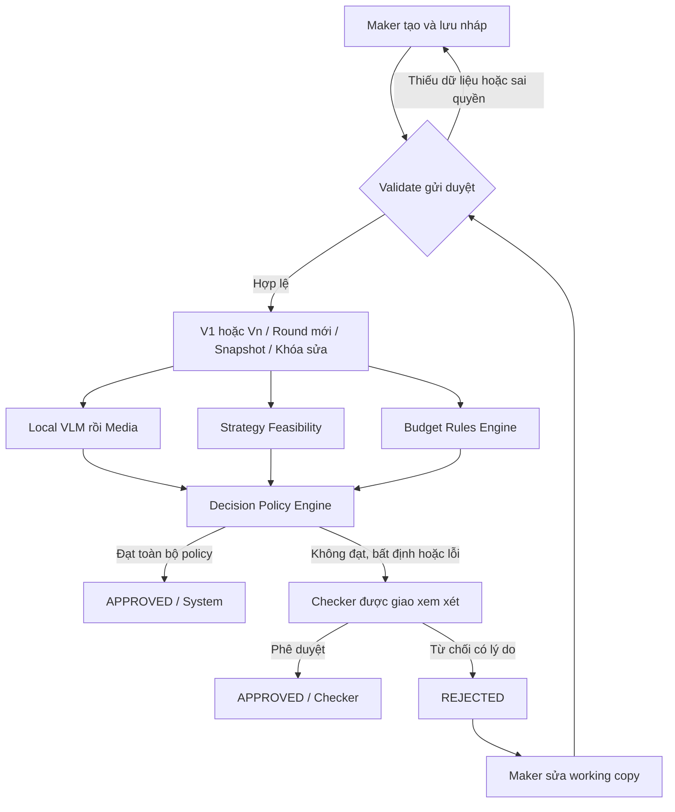

# 01 · Phạm vi, actor và quy trình nghiệp vụ

> Bộ Role 1 · Bản 2.1 · Ngày 21/09/2026 · Phạm vi: tài liệu nghiệp vụ và evaluation cho Sprint 1.
> Trạng thái: bản soạn để review; không phải xác nhận PO đã phê duyệt hoặc ứng dụng đã chạy đạt.

**Căn cứ:** Scope §§2, 4–11, 17–18; Sprint §§1–3, 6, 13.

**Quy ước:** `[NGUỒN]` = yêu cầu đọc được trong hai file mới; `[ĐỀ XUẤT]` = thiết kế bổ sung cần chốt; `[DEMO]` = dữ liệu tổng hợp; `[CHƯA CHẠY]` = chưa có kết quả thực thi. Danh sách đầu việc Role 1 kế thừa bộ cũ; chưa đối chiếu lại được nguyên văn file phân công Role đã không còn tại đường dẫn trước đây.

## 1. Mục tiêu Role 1

Chuyển yêu cầu sản phẩm thành quy tắc, dữ liệu mẫu, expected result và tiêu chí nghiệm thu có thể dùng để xây app. Bộ này không thực thi WP1–WP6, không tạo ứng dụng, không thay thế kiểm thử trên backend. Các master prompt bên trong Sprint là nội dung tham khảo cho đội triển khai, không phải lệnh triển khai phần mềm của yêu cầu hiện tại.

Role 1 sở hữu nghiệp vụ/nhãn kỳ vọng; đội triển khai sở hữu code. Khi khác nhau, mở defect hoặc yêu cầu đổi policy có lý do, không sửa expected chỉ để có kết quả xanh.

## 2. Phân biệt Phase 1 và Sprint 1

| Hạng mục | Phase 1 | Sprint 1 | Bàn giao từ Role 1 |
|---|---|---|---|
| Kế hoạch chung, 1 cấp, 1 Checker | Có | Must | State machine, validation, quyền |
| Tạo/nháp/danh sách/chi tiết/gửi/duyệt/từ chối/gửi lại | Có | Must | Luồng chính và ngoại lệ |
| File | PDF, Office và ảnh là danh sách đề xuất | Upload hình ảnh là Must | Seed ảnh; không ép parser Office vào Must |
| Version, round, audit, chống tự duyệt | Có | Must | Invariants và expected |
| Local VLM, Media, Strategy, Budget, Decision | Có | Must | Input/output và policy |
| Mock VLM | Giải pháp hỗ trợ triển khai | Must, ít nhất 3 tình huống | PASS, low-confidence, timeout |
| SLA | Bắt buộc Phase 1, nhiều cách tính | Should, giờ liên tục | Đặc tả tùy chọn; không đánh trượt Must vì thiếu |
| In-app notification | Có | Should ở §3.2, có trong WP5 | Ghi mâu thuẫn ưu tiên, xem OQ-04 |
| Email thật | Có | Không làm | Không đưa vào gate Sprint |
| Nhân viên, tài khoản, role builder đầy đủ | Có | Không làm; chỉ seed user/role | Ma trận quyền cố định |
| Cấu hình threshold/limit bằng UI | Có | Should | Có seed/config hợp lệ dù chưa có UI |
| Retry thủ công, dashboard | Có/định hướng | Should | Không chặn vertical slice |
| Shadow | Có trong Phase 1 | Không được ghi là Must riêng | Mô tả semantics; ưu tiên hai nhánh demo |

Không triển khai nhiều cấp/duyệt song song/ủy quyền/thu hồi/sửa quyết định đã hoàn tất/tự động từ chối. Không phát sinh trạng thái nghiệp vụ mới để mô tả lỗi AI.

## 3. Actor và trách nhiệm

| Actor | Làm gì | Không được làm |
|---|---|---|
| Maker | Tạo, sửa bản nháp/bản bị từ chối của mình, upload, gửi/gửi lại | Sửa snapshot đã gửi; duyệt chính kế hoạch mình |
| Checker được giao | Xem ảnh, bằng chứng, điểm, lịch sử; approve/reject sau khi AI kết thúc hoặc thất bại | Sửa output AI; xử lý hồ sơ không được giao |
| Administrator | Seed/cấu hình theo quyền; theo dõi lỗi, kiểm tra log | Có quyền admin không đồng nghĩa tự có quyền ra quyết định mọi kế hoạch |
| Local VLM | OCR, mô tả, đối tượng, chất lượng, vùng bằng chứng, confidence | Approve/reject; quyết định ngân sách |
| Media Compliance | Đối chiếu bằng chứng với policy, trả PASS/REVIEW_REQUIRED | Trả FAIL để tự động từ chối |
| Strategy Feasibility | Điểm từng tiêu chí, tổng điểm, confidence, giả định và thiếu sót | Bịa nguồn thị trường hoặc bảo đảm hiệu quả thực tế |
| Budget Rules Engine | So sánh số tiền với snapshot hạn mức bằng quy tắc xác định | Dùng LLM quyết định vượt hạn mức |
| Orchestrator/Decision Engine | Điều phối, kiểm tra contract, tổng hợp và quyết định auto hoặc human | Giả danh Checker; lấy kết quả V1 quyết định cho V2 |

## 4. Trạng thái và điều kiện thao tác

| Business status | Maker | Checker | AI |
|---|---|---|---|
| DRAFT | Sửa, lưu, upload, gửi | Chưa ra quyết định | Chưa chạy pipeline gửi duyệt |
| PENDING_APPROVAL | Chỉ đọc | Chỉ quyết định khi được giao và AI đã kết thúc/thất bại | AI_PENDING → AI_PROCESSING → kết quả |
| APPROVED | Chỉ đọc | Không sửa quyết định | Nguồn quyết định AI_AUTO_APPROVAL hoặc CHECKER |
| REJECTED | Sửa working copy, lưu vẫn REJECTED, gửi lại | Không sửa lý do/quyết định cũ | Gửi lại tạo run mới |

Internal processing stage: `AI_PENDING`, `AI_PROCESSING`, `HUMAN_REVIEW_REQUIRED`, `AI_AUTO_APPROVED`, `AI_PROCESSING_FAILED`. Lỗi pipeline giữ business status `PENDING_APPROVAL`; queue phải nhận cả HUMAN_REVIEW_REQUIRED và AI_PROCESSING_FAILED. Nếu UI cần một nhãn, dùng “Cần người phê duyệt xem xét”, nhưng không làm mất failure reason.

## 5. Quy trình chi tiết và dữ liệu giữ lại

1. Maker đăng nhập, tạo kế hoạch; dữ liệu chưa đủ vẫn lưu nháp nếu các giá trị đã nhập đúng định dạng.
2. Upload ảnh; upload lỗi giữ nội dung form. Kiểm tra loại/kích thước/số lượng ở backend lẫn frontend theo cấu hình.
3. Gửi duyệt: kiểm tra trường bắt buộc, quyền, ít nhất một file, Checker active khác Maker; hiện xác nhận.
4. Transaction gửi tạo immutable version, round ACTIVE, snapshot policy/limit và SLA nếu triển khai; khóa sửa; ghi event. Retry gửi không tạo thêm vòng.
5. Chạy đúng ảnh trong version; lưu hash file và hash input. Không lấy ảnh working copy mới thay snapshot.
6. Media dùng evidence VLM; Strategy dùng nội dung kế hoạch; Budget dùng số tiền VND trong form/snapshot. OCR chỉ là bằng chứng để đối chiếu, không tự thay số tiền.
7. Engine kiểm tra gate. Thiếu kết quả/timeout/schema lỗi/conflict/không chắc chắn → human. Không rollback submit vì lỗi AI.
8. Tự duyệt phải kiểm tra lại round ACTIVE và business status trong cùng transaction; tạo đúng một final decision, đóng round, ghi actor System.
9. Checker xem read-only nội dung + bằng chứng + lý do cần người; approve hoặc reject. Reject phải có reason; override khuyến nghị phải có override reason.
10. Maker sửa sau reject trên working copy, không sửa V1. Gửi lại tạo V2/Round 2/run mới/snapshot mới; giữ V1, file cũ, AI cũ và quyết định cũ.

## 6. Invariants để nghiệm thu

- Mỗi kế hoạch tối đa một round đang ACTIVE; mỗi round tối đa một final decision đã commit.
- Mỗi round tối đa một AI run active; retry có correlation/attempt liên kết, không nhân đôi quyết định.
- `APPROVED` có thể do System hoặc Checker; `REJECTED` trong luồng Sprint này chỉ do Checker.
- `HUMAN_REVIEW_REQUIRED` là route/stage, không phải final decision và không đóng round.
- Snapshot có thể ghi cấu hình thiếu ở dạng lỗi để chuyển người; không bịa một limit mặc định khi không tìm thấy.
- Thông báo/SLA optional không được làm mất transaction nghiệp vụ. SLA nếu có bắt đầu từ submit, bao gồm thời gian AI.

## 7. Tiêu chí kết thúc phần tài liệu

Có traceability đến nguồn, quy tắc đã phân loại mức chắc chắn, 15 case nền + 5 Verify + 18 test bắt buộc, ma trận quyền, contract và danh sách thiếu dữ liệu. “Tài liệu đủ để review” khác “MVP đạt DoD”; việc sau cần build, môi trường và bằng chứng của đội triển khai.
