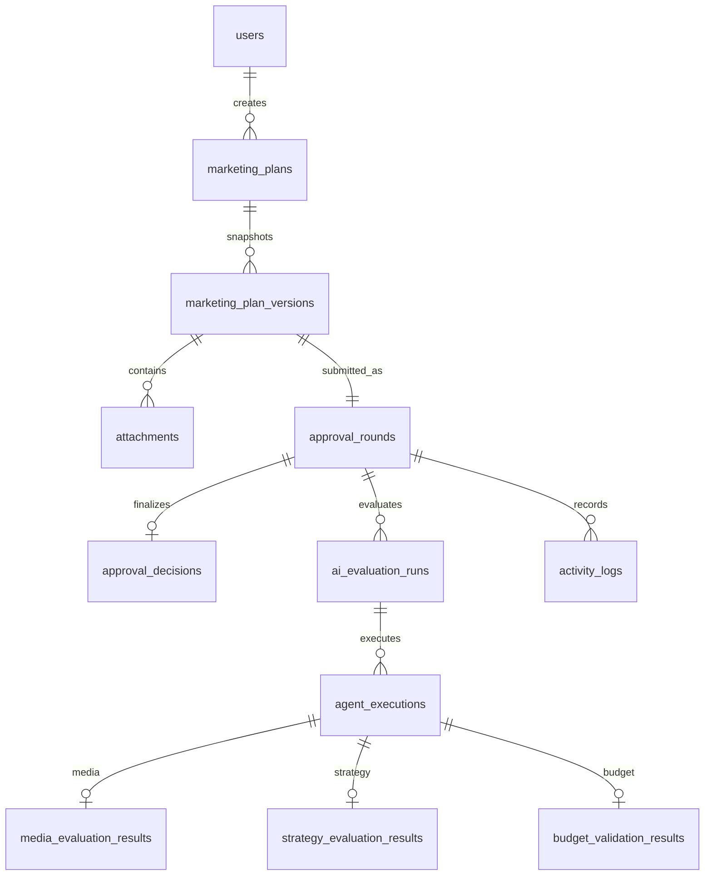

# 12 · Từ điển dữ liệu, quan hệ và ràng buộc lưu trữ

> **Sửa v2.1:** GT-007/008/009 và VERIFY-A04 giữ FACT_UNCERTAIN; thêm dữ kiện có cấu trúc trong input.fact_verification. Đây là **extension fixture đề xuất**, chưa xác minh schema WP1/WP2 thực tế. Không tự coi thêm field vào JSON là engine đã hỗ trợ. Xem [hướng dẫn mapping](19-wp1-wp2-mapping-and-regression.md) trước khi import.

> Bộ Role 1 · Bản 2.1 · Ngày 21/09/2026 · Phạm vi: tài liệu nghiệp vụ và evaluation cho Sprint 1.
> Trạng thái: bản soạn để review; không phải xác nhận PO đã phê duyệt hoặc ứng dụng đã chạy đạt.

**Căn cứ:** Scope §§9, 11, 19; Sprint §§5–6. Tên field mở rộng và constraint vật lý là đề xuất thiết kế.

**Quy ước:** `[NGUỒN]` = yêu cầu đọc được trong hai file mới; `[ĐỀ XUẤT]` = thiết kế bổ sung cần chốt; `[DEMO]` = dữ liệu tổng hợp; `[CHƯA CHẠY]` = chưa có kết quả thực thi. Danh sách đầu việc Role 1 kế thừa bộ cũ; chưa đối chiếu lại được nguyên văn file phân công Role đã không còn tại đường dẫn trước đây.

## 1. Quy ước dùng cho app

- ID: UUID hoặc ID theo convention repo; các ID dạng DEMO/GT chỉ dùng fixture.
- Timestamp: lưu UTC ISO-8601; ngày triển khai kế hoạch là date YYYY-MM-DD; timezone hiển thị có cấu hình. Không suy ra thời gian xử lý từ ngày kế hoạch.
- Money: `[ĐỀ XUẤT]` integer VND không âm; tính bằng kiểu integer đủ lớn/decimal chính xác. Không dùng float cho tiền. Giới hạn giá trị lớn nhất cần chốt theo database/UI.
- Score: decimal [0,100]; confidence: decimal [0,1]; weight: decimal phần trăm, tổng 100.
- Field tùy chọn dùng null/empty theo schema thống nhất; không đổi null budget thành 0. Không dùng null để che execution error.
- Enum kinh doanh chỉ có 4 trạng thái. Các enum route/stage/execution/round được tách rõ, không dùng một cột `status` chung cho mọi ý nghĩa.

## 2. Quan hệ tối thiểu

ERD ở mức logic: version ở đây là **version đã gửi**, 1 version/round theo BR-VER. Run có thể giữ nhiều lịch sử/attempt nhưng tối đa một active. VisualExtraction có thể nằm trong structured output của AgentExecution để không thêm bảng ngoài Sprint tối thiểu. Không hàm ý mỗi execution có cả ba loại result.

## 3. Entity/field cần có

### 3.1 users [Must seed; không làm module nhân sự đầy đủ]

`id`, `display_name`, `department_id`, `is_active`, `account_status`, `roles/permissions` hoặc FK theo hệ thống sẵn có. `job_title` nếu có chỉ là metadata. Password/session theo auth có sẵn, không thiết kế mới từ tài liệu này. Cho phép một user có nhiều role, không suy ra tự duyệt.

### 3.2 marketing_plans [Must]

| Field | Kiểu/nullable | Ý nghĩa/constraint |
|---|---|---|
| id, code | ID/text, not null | code unique, server sinh |
| maker_id, department_id | ID, not null | Người tạo và scope; lấy từ auth/profile |
| checker_id | ID, nullable draft | Bắt buộc hợp lệ khi gửi; bản sao hiện tại, round giữ assignment |
| name/objective/summary | text, nullable draft | Required submit, xem file 02 |
| target_audience/channels/kpi_expected/notes | text/list, optional | Không chặn submit chỉ vì thiếu |
| start_date/end_date | date, nullable draft | Khi đủ phải start≤end |
| budget_vnd/currency | integer + VND | Bắt buộc submit, >=0; draft có thể null |
| status | business enum | DRAFT/PENDING_APPROVAL/APPROVED/REJECTED |
| current_version/current_approval_round | integer/ref | Chỉ tăng khi gửi hợp lệ, không tăng mỗi lần lưu nháp |
| processing_stage | internal enum/null | Chưa gửi có thể null |
| row_version | integer/token | Optimistic concurrency, không thay thế transaction unique decision |
| created_at/updated_at | timestamp | Audit business bổ sung ở activity_logs |

Lưu working copy để Maker sửa sau reject; không dùng cột mutable ở plan thay thế payload của bản đã gửi. Trạng thái/AI tóm tắt trên plan phải truy về version/round hiện tại để tránh hiển thị score cũ.

### 3.3 marketing_plan_versions [Must]

`id, plan_id, version_number, payload_snapshot, attachment_manifest, input_hash, submitted_at, submitted_by`. Payload chứa toàn bộ giá trị nghiệp vụ tại submit, kể cả optional null. Unique `(plan_id, version_number)`; immutable sau khi gửi. Attachment manifest gồm ID/hash/MIME/size, không chỉ tên file.

### 3.4 attachments [Must]

`id, owner_plan_id, version_id hoặc bảng liên kết snapshot, original_name, storage_key, mime_type, byte_size, sha256, upload_status, uploaded_by, uploaded_at`. Access qua quyền plan; đường dẫn file không phải authorization. File cũ bị thay trong working copy vẫn phải được lịch sử tham chiếu và giữ bytes/hash cũ. Scan malware/retention/encryption nếu có phải theo nền tảng; không khẳng định đã triển khai trong Sprint.

### 3.5 approval_rounds [Must]

`id, plan_id, plan_version_id, round_number, checker_id, status, decision_source, started_at, completed_at, sla_deadline(nullable), policy_snapshot, budget_limit_snapshot, sla_snapshot(nullable), assignment_history_ref`.

`status` đề xuất ACTIVE/COMPLETED; approved/rejected nằm trong final decision và business status. Unique `(plan_id, round_number)` và tối đa một ACTIVE/plan. Snapshot copy nội dung/version/effective time, không chỉ FK đến cấu hình mutable. `decision_source=null` khi chưa có final.

### 3.6 approval_decisions [Must]

`id, approval_round_id(unique), decision(APPROVED|REJECTED), decision_source(AI_AUTO_APPROVAL|CHECKER), actor_id(nullable for System), actor_type, reason, ai_recommendation, override_reason, rule_ids, evidence_summary, policy_version, created_at`.

Chỉ final decision được lưu ở bảng này; human route không tạo hàng final giả. System approval dùng actor_type SYSTEM, actor_id null hoặc principal hệ thống rõ ràng theo repo; không mượn ID Checker. CHECKER phải có actor_id. REJECTED cần reason trim non-empty. Override giữ recommendation gốc. Không update/delete quyết định để “undo”.

### 3.7 ai_evaluation_runs [Must]

`id, approval_round_id, correlation_id, status, policy_snapshot, model/agent/prompt version manifest, input_hash, started_at, completed_at, failure_reason, retry_of_run_id(nullable)`.

Execution status đề xuất QUEUED/RUNNING/SUCCEEDED/FAILED/TIMED_OUT. `SUCCEEDED` chỉ nghĩa pipeline trả đủ kết quả, không đồng nghĩa approved. Retry có thể cùng run + attempt hoặc run liên kết; chọn một phương án theo repo, giữ một active và không mất lịch sử.

### 3.8 agent_executions [Must]

`id, run_id, agent_type, attempt_no, status, input_hash, structured_output, raw_output_ref(optional), score(nullable khi không áp dụng), confidence(nullable cho deterministic budget), evidence_refs, model_version, agent_version, prompt_version, policy_version, started_at, completed_at, latency_ms, error_code, error_message`.

VLM/Media/Strategy yêu cầu confidence và model/agent metadata đúng contract. Budget không dùng xác suất; thay vì bịa confidence=1, dùng schema riêng cho deterministic result, xem file 16. Đây là đề xuất cần thống nhất vì mẫu chung Sprint chưa phân biệt rõ các kiểu component.

### 3.9 Kết quả đánh giá [Must]

| Entity | Field chính |
|---|---|
| VisualExtraction trong structured output | attachment_id/hash, OCR regions, description, objects, quality_flags, evidence[], confidence, metadata |
| media_evaluation_results | execution_id, outcome PASS/REVIEW_REQUIRED, media_confidence, hard_violations[], warnings[], evidence[], policy_version |
| strategy_evaluation_results | execution_id, criteria[{id,score,weight,evidence,reason}], total_score, confidence, assumptions[], critical_gaps[] |
| budget_validation_results | execution_id, amount, currency, applicable_limit, snapshot_id, result IN_LIMIT/EXCEEDED/UNKNOWN/UNSUPPORTED_CURRENCY, difference_vnd(nullable), rule_ids |

Difference đề xuất `amount-limit`: âm = dưới hạn mức; nhãn UI phải chỉ rõ để không nhầm “còn lại”. Nếu hiển thị headroom dùng `limit-amount` với tên khác.

### 3.10 auto_approval_policies / budget_limits [Must seed/config]

Policy: `id, version, scope, mode, enabled, score_threshold, vlm_confidence_threshold, media_confidence_threshold(proposed), strategy_confidence_threshold, criteria_weights, content_policy_ref, timeout_config, effective_from, effective_to, status, created_by/at`.

Limit: `id, version, scope, currency, amount, effective_from, effective_to, status, changed_by/at`. Không có limit công ty thật trong nguồn. Ưu tiên scope/giải quyết overlap phải chốt; nếu chưa xác định thì UNKNOWN và human.

### 3.11 activity_logs [Must] / notifications [Should]

Log: `id, event_type, actor_type/id, role_snapshot, plan_id, version_id, round_id, run_id, correlation_id, occurred_at, previous_state, next_state, result, reason/error, relevant_versions, evidence_refs`.

Notification nếu làm: `id, event_id, round_id, recipient_id, channel, type, payload_ref, delivery_status, retry_count, dedupe_key, created_at/sent_at/read_at`. Unique dedupe event-recipient-channel. Notification failure không đổi final decision. Bảng notifications có trong Sprint §6 nhưng UI/in-app là Should tại §3.2: không chứng minh tính năng đã làm chỉ vì có bảng.

## 4. Dữ liệu ngoài Must Sprint

Employee/Department/JobTitle module đầy đủ; SLAConfiguration lịch làm việc; InternalNote; HumanOverride bảng riêng; policy admin UI; email templates. Có thể tái sử dụng hệ thống sẵn có nhưng không bắt xây tất cả. Override reason vẫn Must, có thể lưu trực tiếp approval_decisions.

## 5. Lưu trữ và hash

`[ĐỀ XUẤT]` hash file = SHA-256 bytes; input_hash = SHA-256 canonical JSON của plan version + attachment IDs/hashes + snapshot IDs/versions. Quy định canonicalization trước, không coi thứ tự key request là nội dung khác. Hash truy vết không tự chứng minh signature/ledger.

Thời gian giữ file/audit, quyền export, backup và bảo mật production chưa được hai nguồn quy định; cần owner quyết định, không đặt số ngày tùy ý. Không xóa dữ liệu version/audit do chức năng sửa/xóa working copy.

## Extension fixture v2.1 — chưa phải database/API contract đã chốt

Object chuẩn duy nhất: input.fact_verification, gồm schema_version, verification_status, assertion_origin và issues[].
Mỗi issue có issue_id, field, affected_input_pointer, issue_type, status, verified_value, sources[], evidence_refs[], rationale và fixture_rule_ref.

Không tạo nhiều alias fact_status/normalized_facts/media.fact_status có thể lệch nhau. verified_value=null nằm ở issue; budget bắt buộc trong form vẫn là số hợp lệ. Budget Engine so sánh số khai báo không chứng minh số đó đã đúng bằng chứng.

input_hash giữ thuật toán cũ plan+policy. evaluation_fixture_hash là checksum artifact mới, bao gồm context/output/evidence. Nó không phải hash chain hoặc field API chắc chắn đã được hỗ trợ.
