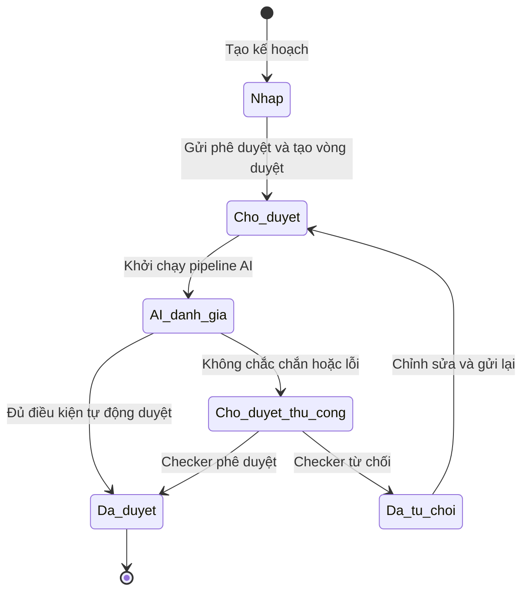

# ĐẶC TẢ PHẠM VI PHASE 1 – PHÊ DUYỆT KẾ HOẠCH MARKETING CÓ HỖ TRỢ AI

| Thuộc tính | Nội dung |
|---|---|
| Phiên bản | 1.1 |
| Ngày cập nhật | 20/09/2026 |
| Trạng thái tài liệu | Baseline cập nhật theo kiến trúc AI, chờ PO/Stakeholder xác nhận |
| Phạm vi | Quản lý và phê duyệt kế hoạch marketing theo mô hình Maker–AI–Checker |
| Cấp phê duyệt | Một cấp phê duyệt |
| Đối tượng kế hoạch | Một loại chung: Kế hoạch marketing |

---

## 1. Mục tiêu tài liệu

Tài liệu này chốt phạm vi nghiệp vụ và chức năng cho Phase 1 của module **Phê duyệt kế hoạch marketing**, làm cơ sở để:

- Thống nhất phạm vi giữa PO, BA, UX/UI và đội phát triển.
- Đặc tả Use Case, màn hình chi tiết và quy trình đánh giá bằng AI.
- Thiết kế wireframe/prototype trên Google Stitch.
- Xây dựng backlog, acceptance criteria và test case.
- Hạn chế việc kế thừa nhầm các nghiệp vụ đặc thù của quy trình onboarding hồ sơ khách hàng.

Tài liệu tập trung vào:

- Actor và phân quyền.
- Cấu trúc menu.
- Vòng đời kế hoạch marketing.
- Luồng tạo, gửi duyệt, phê duyệt, từ chối và gửi lại.
- Quản lý nhân viên và vai trò.
- Cấu hình người phê duyệt và SLA.
- Thông báo, lịch sử, phiên bản và audit log.
- Trích xuất nội dung hình ảnh bằng Local VLM.
- Đánh giá mức độ phù hợp của nội dung truyền thông.
- Đánh giá tính khả thi của chiến lược marketing.
- Kiểm tra hạn mức ngân sách bằng rules engine.
- Tự động phê duyệt có điều kiện và chuyển Checker khi cần can thiệp.
- Phạm vi Phase 1 và các nội dung để Phase 2.

---

## 2. Bối cảnh và nguyên tắc thiết kế

### 2.1. Bối cảnh

Hệ thống hiện có quy trình onboarding hồ sơ khách hàng với các thành phần có thể tái sử dụng như:

- Màn hình danh sách hồ sơ.
- Màn hình biểu mẫu và chi tiết hồ sơ.
- Upload và quản lý file.
- Thanh trạng thái.
- Cơ chế phê duyệt/từ chối.
- Thông báo.
- SLA.
- Lịch sử và ghi chú.
- Quản lý nhân viên, tài khoản, vai trò và phân quyền.

Module kế hoạch marketing sẽ **kế thừa khung chức năng và thành phần UI**, nhưng thay thế biểu mẫu, trạng thái và quy tắc bằng nghiệp vụ marketing.

### 2.2. Các quyết định phạm vi đã chốt

1. Phase 1 chỉ quản lý một loại đối tượng chung là **Kế hoạch marketing**.
2. Chưa tách riêng Marketing Plan, Campaign Plan, Content Plan hoặc Media Plan.
3. Áp dụng mô hình **Maker–AI–Checker** với một cấp phê duyệt; AI có thể tự động duyệt theo policy hoặc chuyển Checker.
4. Mỗi kế hoạch có một Maker và một Checker chính tại một thời điểm.
5. Chỉ có hai quyết định của Checker: **Phê duyệt** hoặc **Từ chối**.
6. Không có quyết định riêng tên là “Yêu cầu chỉnh sửa”.
7. Kế hoạch bị từ chối được phép chỉnh sửa và gửi duyệt lại.
8. Phase 1 không giới hạn cứng số lần từ chối hoặc gửi lại.
9. Mỗi lần gửi lại tạo một phiên bản/vòng duyệt mới và giữ nguyên lịch sử cũ.
10. SLA, thông báo và audit log là thành phần bắt buộc.
11. Kế thừa module quản lý nhân viên và phân quyền hiện có; không xây một module nhân viên riêng cho Marketing.
12. Không gắn cứng Maker/Checker với chức danh nhân sự.
13. Nhân viên không sử dụng POS không cần mã PIN POS hoặc quyền bán hàng.
14. Mỗi phiên bản được gửi duyệt phải trải qua quy trình đánh giá AI trước khi có quyết định cuối cùng.
15. Local VLM chỉ trích xuất và mô tả bằng chứng từ hình ảnh; không tự đưa ra quyết định phê duyệt cuối cùng.
16. Media Compliance Agent đánh giá mức độ phù hợp của hình ảnh dựa trên policy và dữ liệu do Local VLM trích xuất.
17. Strategy Feasibility Agent đánh giá tính khả thi của kế hoạch theo bộ tiêu chí và trọng số được quản trị.
18. Budget Rules Engine kiểm tra hạn mức bằng quy tắc xác định; không sử dụng mô hình ngôn ngữ để quyết định việc vượt hạn mức.
19. Hệ thống chỉ tự động phê duyệt khi đồng thời đáp ứng toàn bộ điều kiện của Auto-Approval Policy.
20. Kế hoạch không đủ điều kiện tự động phê duyệt được chuyển cho Checker xử lý; Phase 1 không tự động từ chối dựa riêng trên kết quả AI.
21. Ngưỡng điểm khả thi mặc định là trên 70%, nhưng phải được quản lý bằng cấu hình có phiên bản và thời gian hiệu lực.
22. Checker được xem bằng chứng, điểm số và lý do chuyển duyệt thủ công trước khi quyết định.
23. Mọi kết quả AI phải lưu model version, policy version, input hash, score, confidence, evidence và thời gian xử lý để truy vết.
24. Bốn trạng thái nghiệp vụ chính được giữ nguyên; tiến trình AI được quản lý bằng trạng thái xử lý nội bộ.

---

## 3. Thuật ngữ

| Thuật ngữ | Tên hiển thị đề xuất | Định nghĩa |
|---|---|---|
| Maker | Người lập kế hoạch | Người tạo, chỉnh sửa và gửi kế hoạch marketing phê duyệt |
| Checker | Người phê duyệt | Người xem xét và ra quyết định phê duyệt hoặc từ chối |
| Administrator | Quản trị viên | Người quản lý nhân viên, vai trò, người phê duyệt, SLA và nhật ký |
| Marketing Plan | Kế hoạch marketing | Hồ sơ nghiệp vụ chứa thông tin và tài liệu kế hoạch cần phê duyệt |
| Approval Round | Vòng duyệt | Một lần kế hoạch được gửi và chờ Checker ra quyết định |
| Version | Phiên bản | Bản dữ liệu kế hoạch được cố định tại thời điểm gửi duyệt |
| SLA | Thời hạn xử lý | Khoảng thời gian tối đa để Checker đưa ra quyết định |
| Audit Log | Nhật ký hệ thống | Dữ liệu hệ thống tự động ghi nhận để phục vụ truy vết |
| Internal Note | Ghi chú nội bộ | Nội dung trao đổi do người dùng chủ động nhập, không làm thay đổi trạng thái |
| Approval Orchestrator | Bộ điều phối phê duyệt | Thành phần điều phối các bước đánh giá AI, tổng hợp kết quả và gọi chính sách quyết định |
| Local VLM | Mô hình thị giác cục bộ | Mô hình chạy trong môi trường kiểm soát để OCR, mô tả và trích xuất bằng chứng từ hình ảnh |
| Media Compliance Agent | Agent kiểm duyệt truyền thông | Đối chiếu bằng chứng hình ảnh với brand guideline và chính sách nội dung |
| Strategy Feasibility Agent | Agent đánh giá chiến lược | Chấm điểm tính khả thi của kế hoạch theo các tiêu chí, trọng số và bằng chứng |
| Budget Rules Engine | Bộ kiểm tra ngân sách | Kiểm tra ngân sách với hạn mức còn hiệu lực bằng quy tắc xác định |
| Auto-Approval Policy | Chính sách tự động duyệt | Tập điều kiện bắt buộc để hệ thống được phép tự động phê duyệt |
| Confidence | Độ tin cậy | Mức độ chắc chắn của kết quả trích xuất hoặc đánh giá AI |
| Hard Violation | Vi phạm nghiêm trọng | Vi phạm policy khiến hồ sơ không đủ điều kiện tự động duyệt và phải chuyển người kiểm tra |
| Human Review | Duyệt thủ công | Nhánh xử lý yêu cầu Checker xem xét và ra quyết định |

Trong giao diện người dùng, ưu tiên dùng **Người lập kế hoạch**, **Đánh giá AI** và **Người phê duyệt**. Thuật ngữ Maker–AI–Checker dùng trong tài liệu nghiệp vụ và kỹ thuật.

---

## 4. Actor và trách nhiệm

| Actor | Trách nhiệm chính | Phạm vi dữ liệu |
|---|---|---|
| Người lập kế hoạch (Maker) | Tạo, lưu nháp, cập nhật, quản lý file, gửi duyệt, xem kết quả, sửa và gửi lại | Các kế hoạch do mình tạo |
| Người phê duyệt (Checker) | Xem kế hoạch được giao, tải file, phê duyệt hoặc từ chối | Các kế hoạch được giao phê duyệt |
| Quản trị viên (Administrator) | Quản lý nhân viên, tài khoản, vai trò, phân quyền, người duyệt, SLA và nhật ký | Toàn bộ dữ liệu trong phạm vi quản trị |
| Hệ thống | Validate, chuyển trạng thái, tạo phiên bản/vòng duyệt, tính SLA, gửi thông báo và ghi log | Xử lý tự động theo rule |
| Approval Orchestrator | Điều phối Local VLM và các agent, quản lý timeout/retry, tổng hợp kết quả | Phiên bản kế hoạch và file thuộc vòng duyệt hiện tại |
| Local VLM | OCR, mô tả ảnh, phát hiện đối tượng, đánh giá chất lượng và trả bằng chứng có confidence | File hình ảnh của phiên bản hiện tại |
| Media Compliance Agent | Kiểm tra hình ảnh theo policy, phát hiện vi phạm/cảnh báo và giải thích bằng chứng | Kết quả VLM và policy truyền thông hiện hành |
| Strategy Feasibility Agent | Chấm điểm tính khả thi và độ tin cậy theo bộ tiêu chí | Dữ liệu kế hoạch, KPI, thời gian, kênh và ngân sách |
| Budget Rules Engine | Đối chiếu ngân sách với hạn mức có hiệu lực | Ngân sách kế hoạch và cấu hình hạn mức |
| Decision Policy Engine | Áp dụng điều kiện auto-approve hoặc chuyển Human Review | Kết quả có cấu trúc từ tất cả agent và rules engine |

### 4.1. Nguyên tắc phân tách trách nhiệm

- Một người có thể được cấp cả quyền lập và quyền phê duyệt để xử lý các kế hoạch khác nhau.
- Người dùng **không được phê duyệt hoặc từ chối kế hoạch do chính mình tạo**.
- Quyết định tự động được ghi nhận với actor là `System/Auto-Approval Policy`, không giả lập danh tính Checker.
- Checker không được sửa kết quả AI; nếu quyết định khác khuyến nghị AI, hệ thống lưu quyết định con người và lý do ghi đè.
- Chức danh nhân sự không tự động quyết định quyền hệ thống.
- Quyền được xác định bởi vai trò hệ thống và cấu hình phân quyền.

---

## 5. Cấu trúc menu Phase 1

```text
Tổng quan

Kế hoạch marketing
├── Tất cả kế hoạch
├── Kế hoạch của tôi
└── Chờ tôi phê duyệt

Nhân viên & phân quyền
├── Danh sách nhân viên
└── Vai trò & phân quyền

Cấu hình phê duyệt
├── Người phê duyệt
├── Cấu hình SLA
├── Hạn mức ngân sách
└── Chính sách AI & tự động duyệt

Thông báo
└── Danh sách thông báo
```

### 5.1. Quy tắc hiển thị menu

- Maker nhìn thấy `Kế hoạch của tôi` và `Thông báo`.
- Checker nhìn thấy `Chờ tôi phê duyệt` và `Thông báo`.
- Người có cả hai quyền nhìn thấy cả hai menu nghiệp vụ.
- `Nhân viên & phân quyền` và `Cấu hình phê duyệt` chỉ hiển thị nếu người dùng có quyền quản trị tương ứng.
- `Chính sách AI & tự động duyệt` chỉ hiển thị cho Administrator có quyền quản trị chính sách AI.
- `Tất cả kế hoạch` chỉ hiển thị cho người có quyền xem toàn bộ.

---

## 6. Trạng thái và vòng đời kế hoạch

### 6.1. Danh sách trạng thái

| Mã | Trạng thái | Ý nghĩa |
|---|---|---|
| DRAFT | Nháp | Kế hoạch đang được Maker chuẩn bị và chưa gửi duyệt |
| PENDING_APPROVAL | Chờ duyệt | Kế hoạch đã gửi và đang chờ Checker xử lý |
| APPROVED | Đã duyệt | Checker đã chấp thuận kế hoạch |
| REJECTED | Đã từ chối | Checker đã từ chối; Maker được xem lý do, sửa và gửi lại |

Không sử dụng các trạng thái:

- Đang duyệt.
- Yêu cầu chỉnh sửa.
- Chờ ngân hàng duyệt.
- Hoàn tất theo nghĩa onboarding.

### 6.1.1. Trạng thái xử lý AI nội bộ

Các giá trị sau không thay thế trạng thái nghiệp vụ của kế hoạch mà mô tả tiến trình xử lý khi kế hoạch đang `PENDING_APPROVAL`:

| Mã | Ý nghĩa | Xử lý tiếp theo |
|---|---|---|
| AI_PENDING | Đã tạo vòng duyệt, đang chờ pipeline AI | Orchestrator khởi chạy các agent |
| AI_PROCESSING | Các agent đang xử lý | Khóa quyết định cho đến khi có kết quả hoặc timeout |
| HUMAN_REVIEW_REQUIRED | Không đủ điều kiện tự động duyệt | Hiển thị trong danh sách của Checker |
| AI_AUTO_APPROVED | Đã đạt toàn bộ điều kiện tự động duyệt | Chuyển trạng thái nghiệp vụ sang Đã duyệt |
| AI_PROCESSING_FAILED | Pipeline lỗi, timeout hoặc thiếu kết quả | Chuyển Checker, không tự động từ chối |

Người dùng cuối ưu tiên nhìn thấy nhãn dễ hiểu như `AI đang đánh giá`, `Cần người phê duyệt xem xét` hoặc `AI xử lý thất bại`; mã kỹ thuật chỉ dùng trong API và audit log.

### 6.2. Sơ đồ trạng thái



### 6.3. Ma trận hành động theo trạng thái

| Hành động | Nháp | Chờ duyệt | Đã duyệt | Đã từ chối |
|---|:---:|:---:|:---:|:---:|
| Maker xem chi tiết | Có | Có | Có | Có |
| Maker chỉnh sửa nội dung | Có | Không | Không | Có |
| Maker thêm/xóa/thay file | Có | Không | Không | Có |
| Maker gửi phê duyệt | Có | Không | Không | Không |
| Maker gửi duyệt lại | Không | Không | Không | Có |
| Checker xem chi tiết | Theo quyền | Có | Có | Có |
| Checker phê duyệt | Không | Có | Không | Không |
| Checker từ chối | Không | Có | Không | Không |
| Hệ thống tự động phê duyệt | Không | Theo policy | Không | Không |
| Xem kết quả đánh giá AI | Không | Có | Có | Có |
| Xem lịch sử | Có | Có | Có | Có |
| Thêm ghi chú nội bộ | Theo quyền | Theo quyền | Theo quyền | Theo quyền |

---

## 7. Luồng nghiệp vụ End-to-End

### 7.1. Tiền điều kiện cấu hình

Trước khi quy trình vận hành, Administrator thực hiện:

1. Tạo hoặc kích hoạt tài khoản nhân viên.
2. Gán vai trò hệ thống.
3. Cấp quyền lập hoặc phê duyệt kế hoạch.
4. Cấu hình người phê duyệt mặc định.
5. Cấu hình SLA đang áp dụng.
6. Cấu hình mẫu thông báo nếu hệ thống cho phép tùy chỉnh.
7. Cấu hình hạn mức ngân sách đang áp dụng.
8. Cấu hình policy truyền thông, tiêu chí đánh giá chiến lược và ngưỡng confidence.
9. Bật/tắt tự động phê duyệt; khi bật phải có Auto-Approval Policy còn hiệu lực.
10. Khai báo phiên bản Local VLM và các agent được phép sử dụng.

### 7.2. Luồng chính

| Bước | Actor | Hành động | Xử lý của hệ thống | Kết quả |
|---:|---|---|---|---|
| 1 | Maker | Chọn tạo kế hoạch | Mở biểu mẫu và tự điền thông tin hệ thống | Kế hoạch chưa được lưu |
| 2 | Maker | Nhập nội dung và upload file | Validate định dạng dữ liệu/file | Dữ liệu sẵn sàng lưu |
| 3 | Maker | Lưu nháp | Sinh mã nếu tạo mới; ghi log | Trạng thái Nháp |
| 4 | Maker | Chọn gửi phê duyệt | Kiểm tra trường bắt buộc, file và Checker | Hiển thị popup xác nhận |
| 5 | Maker | Xác nhận gửi | Tạo phiên bản/vòng duyệt, khóa dữ liệu, snapshot SLA/policy/hạn mức và đặt AI_PENDING | Trạng thái Chờ duyệt |
| 6 | Approval Orchestrator | Khởi chạy pipeline | Tạo các tác vụ Local VLM, kiểm duyệt truyền thông, đánh giá chiến lược và kiểm tra ngân sách | AI_PROCESSING |
| 7 | Local VLM | Trích xuất hình ảnh | OCR, mô tả, phát hiện đối tượng/chất lượng/rủi ro và trả confidence | Bằng chứng hình ảnh có cấu trúc |
| 8 | Media Compliance Agent | Đánh giá nội dung truyền thông | Đối chiếu policy, trả PASS/REVIEW, vi phạm, cảnh báo và evidence | Kết quả kiểm duyệt hình ảnh |
| 9 | Strategy Feasibility Agent | Đánh giá chiến lược | Chấm điểm theo tiêu chí, confidence, critical gaps và assumption | Kết quả khả thi có giải thích |
| 10 | Budget Rules Engine | Kiểm tra ngân sách | So sánh ngân sách với snapshot hạn mức còn hiệu lực | Kết quả trong/vượt hạn mức |
| 11A | Decision Policy Engine | Tất cả điều kiện auto-approve đạt | Lưu quyết định tự động, dừng SLA, gửi thông báo và ghi audit | Trạng thái Đã duyệt |
| 11B | Decision Policy Engine | Không đạt hoặc có bất định/lỗi | Ghi lý do chuyển người, thông báo Checker | HUMAN_REVIEW_REQUIRED |
| 12 | Checker | Mở kế hoạch được giao | Hiển thị dữ liệu read-only, bằng chứng AI, file, SLA và lịch sử | Sẵn sàng ra quyết định |
| 13A | Checker | Phê duyệt | Lưu quyết định, dừng SLA, gửi thông báo, ghi log | Trạng thái Đã duyệt |
| 13B | Checker | Từ chối và nhập lý do | Lưu lý do, dừng SLA, gửi thông báo, ghi log | Trạng thái Đã từ chối |
| 14 | Maker | Xem lý do và chỉnh sửa | Cho phép sửa nội dung/file; bảo toàn bản cũ và kết quả AI cũ | Vẫn Đã từ chối |
| 15 | Maker | Gửi duyệt lại | Tạo phiên bản/vòng duyệt mới, snapshot mới và chạy lại pipeline | Trạng thái Chờ duyệt |

### 7.3. Kết quả kết thúc

- Luồng kết thúc thành công khi kế hoạch ở trạng thái `Đã duyệt`.
- Kế hoạch `Đã từ chối` chưa phải kết thúc vĩnh viễn; Maker có thể chỉnh sửa và gửi lại.
- Kế hoạch được tự động duyệt và kế hoạch được Checker duyệt có cùng trạng thái nghiệp vụ nhưng phải phân biệt `decision_source` trong lịch sử.
- Pipeline AI thất bại không làm rollback thao tác gửi duyệt và không tự động từ chối kế hoạch.
- Phase 1 không tự động đóng kế hoạch sau một số lần từ chối.

---

## 8. Danh sách tính năng trong phạm vi

### 8.1. Nhóm Nhân viên và tài khoản

| ID | Tính năng | Actor | Mô tả phạm vi | Ưu tiên |
|---|---|---|---|---|
| EMP-01 | Quản lý danh sách nhân viên | Administrator | Xem; tìm theo tên, mã, số điện thoại, email; lọc theo bộ phận, chức danh, vai trò và trạng thái | Must |
| EMP-02 | Quản lý thông tin nhân viên | Administrator | Tạo, xem, cập nhật và ngừng hoạt động nhân viên | Must |
| EMP-03 | Quản lý tài khoản đăng nhập | Administrator | Tạo tài khoản, đặt lại mật khẩu, khóa/mở khóa | Must |
| EMP-04 | Gán vai trò hệ thống | Administrator | Gán vai trò quyết định quyền sử dụng module | Must |
| EMP-05 | Kiểm soát nhân viên ngừng hoạt động | Administrator/System | Không cho chọn làm Checker; yêu cầu chuyển kế hoạch đang chờ nếu cần | Must |

Thông tin nhân viên Phase 1:

- Mã nhân viên.
- Họ và tên.
- Số điện thoại.
- Email.
- Bộ phận.
- Chức danh.
- Vai trò hệ thống.
- Tài khoản đăng nhập.
- Ngày bắt đầu làm việc.
- Trạng thái nhân viên.
- Trạng thái tài khoản.

Không yêu cầu cho nhân viên chỉ sử dụng module Marketing:

- Mã PIN POS.
- Cho phép bán hàng.
- Đăng nhập POS.
- Hoa hồng.
- Ca làm việc.

Nếu module nhân viên dùng chung toàn hệ thống, các trường POS chỉ hiển thị khi người dùng được cấp nghiệp vụ POS.

### 8.2. Nhóm Vai trò và phân quyền

| ID | Tính năng | Actor | Mô tả phạm vi | Ưu tiên |
|---|---|---|---|---|
| PER-01 | Quản lý danh sách vai trò | Administrator | Xem, tìm kiếm, lọc, tạo, sửa, ngừng hoạt động vai trò | Must |
| PER-02 | Phân quyền kế hoạch marketing | Administrator | Cấu hình quyền xem, tạo/sửa, gửi, duyệt/từ chối và xem toàn bộ | Must |
| PER-03 | Phân quyền quản trị | Administrator | Quản lý nhân viên, vai trò, người phê duyệt, SLA và nhật ký | Must |
| PER-04 | Xem tóm tắt quyền | Administrator | Hiển thị quyền kế thừa từ vai trò tại hồ sơ nhân viên | Should |

Các quyền trong nhóm `Kế hoạch marketing`:

- Xem kế hoạch.
- Tạo kế hoạch.
- Chỉnh sửa kế hoạch của mình.
- Quản lý file đính kèm.
- Gửi kế hoạch phê duyệt.
- Xem kế hoạch được giao phê duyệt.
- Phê duyệt kế hoạch.
- Từ chối kế hoạch.
- Xem toàn bộ kế hoạch.
- Xem lịch sử xử lý.
- Thêm ghi chú nội bộ.

Vai trò mẫu:

| Vai trò | Quyền chính |
|---|---|
| Người lập kế hoạch marketing | Xem, tạo, sửa, quản lý file và gửi kế hoạch của mình |
| Người phê duyệt kế hoạch marketing | Xem kế hoạch được giao, tải file, phê duyệt và từ chối |
| Quản trị kế hoạch marketing | Xem toàn bộ, cấu hình người duyệt, SLA và nhật ký |
| Quản trị viên hệ thống | Toàn quyền theo phạm vi hệ thống |

### 8.3. Nhóm Quản lý kế hoạch marketing

| ID | Tính năng | Actor | Mô tả phạm vi | Ưu tiên |
|---|---|---|---|---|
| PLN-01 | Tra cứu danh sách kế hoạch | Maker, Checker, Administrator | Xem danh sách, tìm kiếm, lọc, phân trang theo phạm vi quyền | Must |
| PLN-02 | Tạo kế hoạch | Maker | Nhập thông tin, upload file và khởi tạo kế hoạch | Must |
| PLN-03 | Lưu nháp | Maker | Lưu dữ liệu chưa hoàn chỉnh ở trạng thái Nháp | Must |
| PLN-04 | Cập nhật kế hoạch | Maker | Sửa kế hoạch Nháp hoặc Đã từ chối | Must |
| PLN-05 | Xem chi tiết | Maker, Checker, Administrator | Xem nội dung, file, người xử lý, trạng thái, SLA, phiên bản và lịch sử | Must |
| PLN-06 | Quản lý file | Maker, Checker | Maker thêm/xóa/thay file khi được sửa; Checker xem/tải file | Must |
| PLN-07 | Gửi phê duyệt | Maker | Validate, xác nhận, tạo vòng duyệt và chuyển sang Chờ duyệt | Must |
| PLN-08 | Chỉnh sửa và gửi lại | Maker | Xem lý do, cập nhật, tạo phiên bản/vòng duyệt mới | Must |
| PLN-09 | Quản lý phiên bản | System | Bảo toàn dữ liệu và file tại từng lần gửi | Must |

### 8.4. Nhóm Phê duyệt

| ID | Tính năng | Actor | Mô tả phạm vi | Ưu tiên |
|---|---|---|---|---|
| APR-01 | Danh sách chờ phê duyệt | Checker | Xem các kế hoạch được giao; tìm kiếm và lọc theo SLA/ngày/người lập | Must |
| APR-02 | Xem xét kế hoạch | Checker | Xem form read-only, file, phiên bản và lịch sử | Must |
| APR-03 | Phê duyệt kế hoạch | Checker | Xác nhận chấp thuận và chuyển sang Đã duyệt | Must |
| APR-04 | Từ chối kế hoạch | Checker | Nhập lý do bắt buộc và chuyển sang Đã từ chối | Must |
| APR-05 | Cấu hình người phê duyệt | Administrator | Thiết lập Checker mặc định và quyền Maker được đổi Checker | Must |

### 8.5. Nhóm SLA

| ID | Tính năng | Actor | Mô tả phạm vi | Ưu tiên |
|---|---|---|---|---|
| SLA-01 | Quản lý danh sách SLA | Administrator | Xem, tìm kiếm, lọc, tạo, sửa, kích hoạt/ngừng áp dụng | Must |
| SLA-02 | Cấu hình thời hạn xử lý | Administrator | Thời gian tối đa, đơn vị và cách tính | Must |
| SLA-03 | Cấu hình cảnh báo | Administrator | Ngưỡng cảnh báo, giờ gửi, người nhận và kênh gửi | Must |
| SLA-04 | Theo dõi SLA kế hoạch | Maker, Checker, Administrator | Hiển thị còn hạn, sắp quá hạn hoặc quá hạn | Must |
| SLA-05 | Ghi lịch sử cấu hình | System | Lưu người thay đổi, giá trị trước/sau và thời gian | Must |

### 8.6. Nhóm Thông báo và lịch sử

| ID | Tính năng | Actor | Mô tả phạm vi | Ưu tiên |
|---|---|---|---|---|
| NOT-01 | Thông báo trong hệ thống | System | Thông báo gửi duyệt, gửi lại, duyệt, từ chối và SLA | Must |
| NOT-02 | Thông báo email | System | Gửi email theo các sự kiện nghiệp vụ | Must |
| HIS-01 | Lịch sử xử lý | Maker, Checker, Administrator | Timeline hệ thống tự động ghi, chỉ đọc | Must |
| HIS-02 | Ghi chú nội bộ | Người có quyền | Nhập ghi chú không làm thay đổi trạng thái | Should |
| HIS-03 | Audit log | Administrator | Truy vết hành động, trạng thái, phiên bản và kết quả | Must |

### 8.7. Nhóm đánh giá AI và tự động phê duyệt

| ID | Tính năng | Actor | Mô tả phạm vi | Ưu tiên |
|---|---|---|---|---|
| AI-01 | Điều phối pipeline đánh giá | Approval Orchestrator | Khởi chạy, theo dõi, retry có kiểm soát và tổng hợp kết quả các agent theo từng phiên bản/vòng duyệt | Must |
| AI-02 | Trích xuất nội dung hình ảnh | Local VLM | OCR, mô tả, đối tượng, chất lượng, vùng bằng chứng, cờ rủi ro và confidence | Must |
| AI-03 | Kiểm duyệt nội dung truyền thông | Media Compliance Agent | Đối chiếu bằng chứng với brand/content policy và trả kết quả có giải thích | Must |
| AI-04 | Đánh giá tính khả thi chiến lược | Strategy Feasibility Agent | Chấm điểm từng tiêu chí, điểm tổng, confidence, assumption và critical gap | Must |
| AI-05 | Kiểm tra hạn mức ngân sách | Budget Rules Engine | So sánh ngân sách với hạn mức và policy có hiệu lực bằng rule xác định | Must |
| AI-06 | Chính sách tự động phê duyệt | Decision Policy Engine, Administrator | Cấu hình và áp dụng đồng thời các điều kiện auto-approve | Must |
| AI-07 | Chuyển duyệt thủ công | System, Checker | Chuyển hồ sơ không đủ điều kiện, lỗi hoặc bất định cho Checker | Must |
| AI-08 | Xem và ghi đè khuyến nghị AI | Checker | Xem evidence/score/confidence; quyết định khác khuyến nghị phải nhập lý do | Must |
| AI-09 | Audit AI | System, Administrator | Lưu input hash, model/agent/prompt/policy version, output, latency và quyết định | Must |
| AI-10 | Theo dõi chất lượng AI | Administrator | Theo dõi tỷ lệ chuyển người, override, false approval được xác nhận và lỗi pipeline | Should |

### 8.8. Nhóm hạn mức ngân sách

| ID | Tính năng | Actor | Mô tả phạm vi | Ưu tiên |
|---|---|---|---|---|
| BUD-01 | Quản lý hạn mức | Administrator | Tạo, sửa, kích hoạt/ngừng áp dụng hạn mức theo phạm vi cấu hình | Must |
| BUD-02 | Kiểm tra hạn mức tại thời điểm gửi | Budget Rules Engine | Xác định cấu hình áp dụng và lưu snapshot kết quả | Must |
| BUD-03 | Lịch sử thay đổi hạn mức | System | Lưu giá trị trước/sau, người thay đổi và thời gian hiệu lực | Must |
| BUD-04 | Hiển thị kết quả kiểm tra | Maker, Checker, Administrator | Hiển thị ngân sách, hạn mức áp dụng, phần còn lại và lý do không đạt | Must |

---

## 9. Dữ liệu biểu mẫu kế hoạch marketing

### 9.1. Trường nghiệp vụ

| Nhóm | Trường | Bắt buộc khi lưu nháp | Bắt buộc khi gửi duyệt | Quy tắc chính |
|---|---|:---:|:---:|---|
| Thông tin chung | Mã kế hoạch | Hệ thống | Hệ thống | Tự sinh, không cho sửa |
| Thông tin chung | Tên kế hoạch | Không | Có | Không chỉ chứa khoảng trắng |
| Thông tin chung | Người lập | Hệ thống | Hệ thống | Lấy theo người tạo |
| Thông tin chung | Bộ phận | Hệ thống | Hệ thống | Lấy theo hồ sơ nhân viên |
| Phê duyệt | Người phê duyệt | Không | Có | Checker hợp lệ và khác Maker |
| Nội dung | Mục tiêu kế hoạch | Không | Có | Textarea |
| Nội dung | Tóm tắt kế hoạch | Không | Có | Textarea |
| Nội dung | Đối tượng mục tiêu | Không | Không | Textarea |
| Nội dung | Kênh triển khai | Không | Không | Multi-select |
| Thời gian | Ngày bắt đầu | Không | Có | Không sau ngày kết thúc |
| Thời gian | Ngày kết thúc | Không | Có | Không trước ngày bắt đầu |
| Ngân sách | Ngân sách dự kiến | Không | Có | Số không âm, đơn vị VNĐ |
| Kết quả | KPI/Kết quả kỳ vọng | Không | Không | Textarea |
| Tài liệu | File đính kèm | Không | Có | Ít nhất một file |
| Bổ sung | Ghi chú | Không | Không | Không làm thay đổi trạng thái |

### 9.2. Trường hệ thống

- Trạng thái.
- Phiên bản hiện tại.
- Số vòng duyệt.
- Ngày tạo.
- Ngày cập nhật.
- Ngày gửi duyệt gần nhất.
- Người duyệt.
- Ngày ra quyết định.
- Hạn SLA.
- Tình trạng SLA.
- Lý do từ chối gần nhất.
- Giai đoạn xử lý AI.
- Nguồn quyết định: AI tự động hoặc Checker.
- Điểm khả thi và confidence hiện tại.
- Kết quả kiểm duyệt truyền thông.
- Kết quả kiểm tra hạn mức ngân sách.
- Phiên bản model, agent và policy đã áp dụng.

### 9.3. File đính kèm

Định dạng đề xuất:

- PDF.
- DOC/DOCX.
- XLS/XLSX.
- PPT/PPTX.
- JPG/JPEG.
- PNG.

Số lượng và dung lượng tối đa được lấy theo cấu hình hệ thống. File phải được kiểm tra cả phía giao diện và phía máy chủ.

---

## 10. Đặc tả Use Case cốt lõi

### UC_MKT_01 – Tra cứu danh sách kế hoạch marketing

| Thuộc tính | Nội dung |
|---|---|
| Tác nhân | Maker, Checker, Administrator |
| Tiền điều kiện | Người dùng đã đăng nhập và có quyền xem kế hoạch |
| Kích hoạt | Người dùng truy cập một menu danh sách kế hoạch |
| Hậu điều kiện | Danh sách phù hợp với phạm vi quyền và điều kiện tìm kiếm được hiển thị |

**Luồng chính:**

1. Người dùng mở danh sách kế hoạch.
2. Hệ thống xác định phạm vi dữ liệu theo quyền.
3. Hệ thống hiển thị dữ liệu mới cập nhật gần nhất trước.
4. Người dùng tìm theo mã/tên hoặc lọc theo trạng thái, người lập, người duyệt, thời gian và SLA.
5. Hệ thống hiển thị kết quả phù hợp.
6. Người dùng chọn một kế hoạch để xem chi tiết.

**Ngoại lệ:** Không có dữ liệu thì hiển thị empty state; không có quyền thì từ chối truy cập.

### UC_MKT_02 – Tạo và cập nhật kế hoạch

| Thuộc tính | Nội dung |
|---|---|
| Tác nhân | Maker |
| Tiền điều kiện | Maker có quyền tạo kế hoạch |
| Kích hoạt | Maker chọn `Tạo kế hoạch` |
| Hậu điều kiện | Kế hoạch được lưu ở trạng thái Nháp hoặc cập nhật thành công |

**Luồng chính:**

1. Hệ thống mở biểu mẫu.
2. Maker nhập thông tin, chọn Checker và upload file.
3. Maker chọn `Lưu nháp`.
4. Hệ thống validate định dạng các dữ liệu đã nhập.
5. Hệ thống sinh mã nếu là bản ghi mới, lưu trạng thái Nháp và ghi lịch sử.

**Ngoại lệ:** File không hợp lệ, dữ liệu sai định dạng, Checker không còn hiệu lực hoặc có xung đột cập nhật.

### UC_MKT_03 – Gửi kế hoạch phê duyệt

| Thuộc tính | Nội dung |
|---|---|
| Tác nhân | Maker |
| Tiền điều kiện | Kế hoạch Nháp; Maker có quyền gửi; có Checker hợp lệ |
| Kích hoạt | Maker chọn `Gửi phê duyệt` |
| Hậu điều kiện | Kế hoạch ở trạng thái Chờ duyệt, được khóa sửa và Checker nhận thông báo |

**Luồng chính:**

1. Hệ thống kiểm tra trường bắt buộc, file và Checker.
2. Hệ thống hiển thị popup xác nhận.
3. Maker xác nhận gửi.
4. Hệ thống cố định phiên bản hiện tại và tạo vòng duyệt.
5. Hệ thống chuyển trạng thái sang Chờ duyệt và khóa dữ liệu.
6. Hệ thống tính SLA, gửi thông báo và ghi lịch sử.

**Ngoại lệ:** Thiếu dữ liệu thì không gửi; Checker không hợp lệ thì yêu cầu chọn lại; thông báo lỗi không rollback trạng thái.

### UC_MKT_04 – Xem và thẩm định kế hoạch

| Thuộc tính | Nội dung |
|---|---|
| Tác nhân | Checker |
| Tiền điều kiện | Kế hoạch Chờ duyệt và được giao cho Checker |
| Kích hoạt | Checker mở kế hoạch từ `Chờ tôi phê duyệt` |
| Hậu điều kiện | Dữ liệu read-only được hiển thị và Checker có thể ra quyết định |

**Luồng chính:**

1. Hệ thống kiểm tra người được giao và quyền thao tác.
2. Hệ thống hiển thị thông tin, file, phiên bản, vòng duyệt, SLA và lịch sử.
3. Checker xem hoặc tải tài liệu.
4. Hệ thống hiển thị nút `Phê duyệt` và `Từ chối` nếu Checker hợp lệ.

### UC_MKT_05 – Phê duyệt kế hoạch

| Thuộc tính | Nội dung |
|---|---|
| Tác nhân | Checker |
| Tiền điều kiện | Kế hoạch Chờ duyệt; Checker được giao; Checker khác Maker |
| Kích hoạt | Checker chọn `Phê duyệt` |
| Hậu điều kiện | Kế hoạch Đã duyệt; SLA kết thúc; Maker nhận thông báo |

**Luồng chính:**

1. Hệ thống hiển thị popup xác nhận.
2. Checker có thể nhập ghi chú phê duyệt.
3. Checker xác nhận.
4. Hệ thống kiểm tra lại quyền và trạng thái để tránh xử lý trùng.
5. Hệ thống lưu quyết định, người duyệt, thời gian và kết quả SLA.
6. Hệ thống chuyển sang Đã duyệt, gửi thông báo và ghi log.

### UC_MKT_06 – Từ chối kế hoạch

| Thuộc tính | Nội dung |
|---|---|
| Tác nhân | Checker |
| Tiền điều kiện | Kế hoạch Chờ duyệt; Checker được giao; Checker khác Maker |
| Kích hoạt | Checker chọn `Từ chối` |
| Hậu điều kiện | Kế hoạch Đã từ chối; Maker nhận lý do và có thể chỉnh sửa |

**Luồng chính:**

1. Hệ thống mở popup từ chối.
2. Checker nhập lý do bắt buộc.
3. Checker xác nhận.
4. Hệ thống lưu quyết định, lý do, người thực hiện và thời gian.
5. Hệ thống kết thúc SLA, chuyển sang Đã từ chối, gửi thông báo và ghi log.

**Ngoại lệ:** Không nhập lý do hoặc chỉ nhập khoảng trắng thì không cho xác nhận.

### UC_MKT_07 – Chỉnh sửa và gửi lại kế hoạch bị từ chối

| Thuộc tính | Nội dung |
|---|---|
| Tác nhân | Maker |
| Tiền điều kiện | Kế hoạch Đã từ chối và thuộc Maker |
| Kích hoạt | Maker chọn `Chỉnh sửa kế hoạch` hoặc `Gửi duyệt lại` |
| Hậu điều kiện | Nếu chỉ lưu: vẫn Đã từ chối; nếu gửi lại: Chờ duyệt với phiên bản/vòng mới |

**Luồng chính:**

1. Maker mở kế hoạch và xem lý do từ chối.
2. Maker chọn chỉnh sửa.
3. Hệ thống cho phép sửa dữ liệu và file.
4. Maker lưu thay đổi; trạng thái vẫn Đã từ chối.
5. Maker chọn gửi duyệt lại.
6. Hệ thống validate và hiển thị xác nhận.
7. Hệ thống tạo phiên bản mới, tăng vòng duyệt, tính SLA mới và chuyển sang Chờ duyệt.
8. Hệ thống gửi thông báo cho Checker và ghi lịch sử.

### UC_MKT_08 – Xem lịch sử và ghi chú nội bộ

| Thuộc tính | Nội dung |
|---|---|
| Tác nhân | Maker, Checker, Administrator |
| Tiền điều kiện | Kế hoạch đã được tạo và người dùng có quyền xem |
| Kích hoạt | Người dùng mở chi tiết kế hoạch |
| Hậu điều kiện | Timeline và ghi chú được hiển thị hoặc bổ sung thành công |

**Luồng chính:**

1. Hệ thống hiển thị `Lịch sử xử lý` ở cuối trang.
2. Người dùng xem các sự kiện theo thời gian.
3. Nếu có quyền, người dùng nhập ghi chú nội bộ và gửi.
4. Hệ thống lưu người gửi, nội dung, thời gian và hiển thị trên timeline ghi chú.

Lịch sử hệ thống và ghi chú nội bộ phải được tách biệt về ý nghĩa và hiển thị.

### UC_MKT_09 – Đánh giá tự động bằng AI

| Thuộc tính | Nội dung |
|---|---|
| Tác nhân | Approval Orchestrator, Local VLM, Media Compliance Agent, Strategy Feasibility Agent, Budget Rules Engine |
| Tiền điều kiện | Đã tạo phiên bản/vòng duyệt; dữ liệu bị khóa; các cấu hình cần thiết có snapshot |
| Kích hoạt | Kế hoạch chuyển sang Chờ duyệt |
| Hậu điều kiện | Có bộ kết quả đánh giá đầy đủ hoặc hồ sơ được đánh dấu cần Checker xử lý |

**Luồng chính:**

1. Orchestrator tạo run duy nhất cho phiên bản/vòng duyệt.
2. Local VLM xử lý từng file hình ảnh và trả dữ liệu có cấu trúc kèm evidence/confidence.
3. Media Compliance Agent đối chiếu policy và trả PASS hoặc REVIEW_REQUIRED.
4. Strategy Feasibility Agent chấm điểm theo tiêu chí, trọng số và trả confidence.
5. Budget Rules Engine kiểm tra ngân sách với snapshot hạn mức.
6. Orchestrator kiểm tra tính đầy đủ, schema và chữ ký/hash của kết quả.
7. Decision Policy Engine đánh giá điều kiện tự động duyệt.

**Ngoại lệ:** Agent lỗi, timeout, output sai schema, confidence thấp hoặc kết quả xung đột thì không tự duyệt; hệ thống chuyển Human Review và ghi audit.

### UC_MKT_10 – Tự động phê duyệt

| Thuộc tính | Nội dung |
|---|---|
| Tác nhân | Decision Policy Engine |
| Tiền điều kiện | Pipeline hoàn thành; policy auto-approve đang bật; kế hoạch vẫn Chờ duyệt |
| Kích hoạt | Orchestrator gửi bộ kết quả hợp lệ |
| Hậu điều kiện | Kế hoạch Đã duyệt với nguồn quyết định là AI_AUTO_APPROVAL |

**Luồng chính:**

1. Hệ thống kiểm tra lại trạng thái và vòng duyệt đang hoạt động.
2. Hệ thống kiểm tra không có hard violation và Media Compliance = PASS.
3. Hệ thống kiểm tra điểm khả thi lớn hơn ngưỡng, confidence đạt ngưỡng và ngân sách trong hạn mức.
4. Hệ thống kiểm tra không có agent lỗi, kết quả thiếu hoặc xung đột chưa giải quyết.
5. Hệ thống lưu quyết định, policy version, evidence summary và thời gian.
6. Hệ thống kết thúc SLA, chuyển sang Đã duyệt, gửi thông báo và ghi audit.

### UC_MKT_11 – Checker xử lý hồ sơ AI chuyển duyệt thủ công

| Thuộc tính | Nội dung |
|---|---|
| Tác nhân | Checker |
| Tiền điều kiện | Kế hoạch Chờ duyệt; AI_PROCESSING đã kết thúc hoặc thất bại; processing stage = HUMAN_REVIEW_REQUIRED/AI_PROCESSING_FAILED |
| Kích hoạt | Checker mở kế hoạch được giao |
| Hậu điều kiện | Checker phê duyệt hoặc từ chối theo quyền hiện có |

**Luồng chính:**

1. Hệ thống hiển thị dữ liệu kế hoạch, ảnh gốc, evidence VLM, kết quả policy, điểm khả thi, confidence và hạn mức.
2. Hệ thống giải thích điều kiện nào khiến hồ sơ không được tự động duyệt.
3. Checker xem xét và chọn Phê duyệt hoặc Từ chối.
4. Nếu quyết định khác khuyến nghị AI, Checker phải nhập lý do ghi đè.
5. Hệ thống lưu song song kết quả AI và quyết định con người, không ghi đè dữ liệu cũ.

### UC_MKT_12 – Quản lý chính sách AI và hạn mức

| Thuộc tính | Nội dung |
|---|---|
| Tác nhân | Administrator |
| Tiền điều kiện | Có quyền quản trị chính sách AI/ngân sách |
| Kích hoạt | Administrator mở màn hình cấu hình tương ứng |
| Hậu điều kiện | Cấu hình mới có phiên bản, thời gian hiệu lực và audit log |

Thay đổi cấu hình chỉ áp dụng cho vòng duyệt bắt đầu sau thời điểm có hiệu lực; vòng đang chạy giữ nguyên snapshot.

---

## 11. Business Rules

### 11.1. Quy tắc người dùng và phân quyền

| Mã rule | Quy tắc |
|---|---|
| BR-AUTH-01 | Người dùng phải đăng nhập và có quyền tương ứng mới được truy cập chức năng |
| BR-AUTH-02 | Maker chỉ sửa kế hoạch do mình tạo, trừ khi có quyền quản trị riêng |
| BR-AUTH-03 | Checker chỉ ra quyết định với kế hoạch được giao |
| BR-AUTH-04 | Maker và Checker của cùng một vòng duyệt không được là cùng một người |
| BR-AUTH-05 | Người có cả quyền Maker và Checker vẫn không được tự duyệt kế hoạch của mình |
| BR-AUTH-06 | Bộ phận, chức danh và vai trò hệ thống là ba thuộc tính độc lập |
| BR-AUTH-07 | Không được xóa vai trò đang được gán cho nhân viên; chỉ cho ngừng hoạt động hoặc chuyển nhân viên trước |
| BR-AUTH-08 | Nhân viên ngừng hoạt động hoặc tài khoản bị khóa không được chọn làm Checker mới |

### 11.2. Quy tắc kế hoạch và trạng thái

| Mã rule | Quy tắc |
|---|---|
| BR-PLAN-01 | Mỗi kế hoạch có một mã duy nhất do hệ thống tự sinh |
| BR-PLAN-02 | Lưu nháp không yêu cầu đủ toàn bộ trường bắt buộc gửi duyệt |
| BR-PLAN-03 | Các giá trị đã nhập khi lưu nháp vẫn phải đúng định dạng |
| BR-PLAN-04 | Chỉ kế hoạch Nháp hoặc Đã từ chối mới được Maker chỉnh sửa |
| BR-PLAN-05 | Kế hoạch Chờ duyệt và Đã duyệt là read-only |
| BR-PLAN-06 | Chỉ hệ thống được chuyển trạng thái theo các hành động hợp lệ |
| BR-PLAN-07 | Không có trạng thái Đang duyệt trong Phase 1 |
| BR-PLAN-08 | Không có hành động Yêu cầu chỉnh sửa riêng; dùng Từ chối kèm lý do |

### 11.3. Quy tắc gửi duyệt và quyết định

| Mã rule | Quy tắc |
|---|---|
| BR-APR-01 | Gửi duyệt phải có đầy đủ trường bắt buộc và ít nhất một file |
| BR-APR-02 | Tại một thời điểm chỉ có một vòng duyệt đang hoạt động cho một kế hoạch |
| BR-APR-03 | Phê duyệt hoặc từ chối phải kiểm tra lại trạng thái để ngăn xử lý trùng |
| BR-APR-04 | Lý do từ chối là bắt buộc và không được chỉ chứa khoảng trắng |
| BR-APR-05 | Lý do từ chối đã xác nhận không được sửa hoặc xóa |
| BR-APR-06 | Sau khi bị từ chối, Maker được sửa và gửi lại |
| BR-APR-07 | Phase 1 không giới hạn số lần gửi lại |
| BR-APR-08 | Quyết định phê duyệt đã hoàn tất không được thay đổi trong Phase 1 |

### 11.4. Quy tắc phiên bản và vòng duyệt

| Mã rule | Quy tắc |
|---|---|
| BR-VER-01 | Lần gửi đầu tiên tạo V1 – Vòng duyệt 1 |
| BR-VER-02 | Gửi lại sau từ chối tạo phiên bản và vòng duyệt kế tiếp |
| BR-VER-03 | Không ghi đè nội dung hoặc file của phiên bản đã gửi trước |
| BR-VER-04 | Checker mặc định xem phiên bản hiện tại nhưng có thể xem lịch sử phiên bản |
| BR-VER-05 | File bị thay thế vẫn được bảo toàn trong phiên bản lịch sử |

Ví dụ:

| Phiên bản | Vòng duyệt | Kết quả |
|---|---:|---|
| V1 | 1 | Đã từ chối |
| V2 | 2 | Đã từ chối |
| V3 | 3 | Đã duyệt |

### 11.5. Quy tắc file

| Mã rule | Quy tắc |
|---|---|
| BR-FILE-01 | Phải có ít nhất một file khi gửi duyệt |
| BR-FILE-02 | Chỉ Maker được thêm/xóa/thay file khi kế hoạch được chỉnh sửa |
| BR-FILE-03 | Checker chỉ được xem hoặc tải file |
| BR-FILE-04 | File bị khóa khi kế hoạch Chờ duyệt hoặc Đã duyệt |
| BR-FILE-05 | Loại, số lượng và dung lượng file được validate cả frontend và backend |
| BR-FILE-06 | Upload thất bại không được làm mất dữ liệu form đã nhập |

### 11.6. Quy tắc cấu hình người phê duyệt

| Mã rule | Quy tắc |
|---|---|
| BR-CHK-01 | Checker phải đang hoạt động, có tài khoản hoạt động và có quyền phê duyệt |
| BR-CHK-02 | Phase 1 chỉ cấu hình một Checker chính cho một kế hoạch |
| BR-CHK-03 | Có thể cấu hình Checker mặc định theo đối tượng và bộ phận |
| BR-CHK-04 | Có thể bật/tắt quyền cho Maker chọn Checker khác trong danh sách hợp lệ |
| BR-CHK-05 | Chỉ một cấu hình người phê duyệt được áp dụng cho cùng đối tượng và bộ phận |
| BR-CHK-06 | Nếu Checker ngừng hoạt động khi còn kế hoạch Chờ duyệt, phải chuyển các kế hoạch sang Checker hợp lệ |

### 11.7. Quy tắc SLA

| Mã rule | Quy tắc |
|---|---|
| BR-SLA-01 | SLA bắt đầu khi kế hoạch chuyển sang Chờ duyệt |
| BR-SLA-02 | SLA kết thúc khi kế hoạch được phê duyệt hoặc từ chối |
| BR-SLA-03 | Gửi lại sau từ chối tạo SLA mới cho vòng duyệt mới |
| BR-SLA-04 | Thời gian xử lý tối đa phải lớn hơn 0 |
| BR-SLA-05 | Thời gian cảnh báo phải lớn hơn 0 và nhỏ hơn thời gian xử lý tối đa |
| BR-SLA-06 | Chỉ một SLA đang áp dụng cho cùng đối tượng tại một thời điểm |
| BR-SLA-07 | Thay đổi SLA chỉ áp dụng cho các vòng duyệt bắt đầu sau khi cấu hình có hiệu lực |
| BR-SLA-08 | Vòng duyệt đang chạy giữ snapshot của cấu hình SLA tại thời điểm gửi |
| BR-SLA-09 | SLA có thể tính theo giờ, ngày làm việc hoặc ngày theo lịch theo cấu hình |
| BR-SLA-10 | Nếu không đọc được SLA do lỗi cấu hình, không rollback việc gửi duyệt; hệ thống ghi cảnh báo và thông báo Administrator |

### 11.8. Quy tắc thông báo

| Mã rule | Quy tắc |
|---|---|
| BR-NOT-01 | Gửi duyệt/gửi lại phải thông báo cho Checker |
| BR-NOT-02 | Phê duyệt/từ chối phải thông báo cho Maker |
| BR-NOT-03 | Thông báo từ chối phải chứa lý do |
| BR-NOT-04 | Sắp quá hạn và quá hạn phải thông báo theo cấu hình SLA |
| BR-NOT-05 | Lỗi gửi thông báo không làm rollback quyết định nghiệp vụ |
| BR-NOT-06 | Hệ thống phải ghi trạng thái gửi và hỗ trợ retry |

### 11.9. Quy tắc lịch sử và audit

| Mã rule | Quy tắc |
|---|---|
| BR-LOG-01 | Lịch sử hệ thống được tạo tự động |
| BR-LOG-02 | Không người dùng nào được sửa hoặc xóa lịch sử nghiệp vụ |
| BR-LOG-03 | Mỗi log phải có người thực hiện, thời gian, hành động và kết quả |
| BR-LOG-04 | Chuyển trạng thái phải lưu trạng thái trước và sau |
| BR-LOG-05 | Gửi duyệt, gửi lại và quyết định phải lưu phiên bản/vòng duyệt |
| BR-LOG-06 | Lý do từ chối phải xuất hiện trong lịch sử quyết định |
| BR-LOG-07 | Ghi chú nội bộ không được coi là lý do từ chối và không làm thay đổi trạng thái |

### 11.10. Quy tắc đánh giá AI và tự động phê duyệt

| Mã rule | Quy tắc |
|---|---|
| BR-AI-01 | Mỗi phiên bản/vòng duyệt chỉ có một AI evaluation run đang hoạt động; retry phải dùng cùng correlation ID hoặc liên kết rõ với run gốc |
| BR-AI-02 | Local VLM chỉ xử lý file thuộc snapshot của phiên bản hiện tại và phải lưu hash của từng file |
| BR-AI-03 | Kết quả không đúng schema, thiếu evidence hoặc không xác định được model version được xem là không hợp lệ |
| BR-AI-04 | Local VLM không được tự đưa ra quyết định phê duyệt/từ chối |
| BR-AI-05 | Media Compliance phải trả PASS hoặc REVIEW_REQUIRED; Phase 1 không dùng kết quả AI để tự động từ chối |
| BR-AI-06 | Strategy Feasibility phải trả điểm từng tiêu chí, điểm tổng, confidence, assumption và critical gap |
| BR-AI-07 | Điểm khả thi phải lớn hơn ngưỡng cấu hình; với ngưỡng mặc định 70, điểm 70 không đủ điều kiện tự động duyệt |
| BR-AI-08 | Auto-approve chỉ được thực hiện khi Media Compliance = PASS, không có hard violation, confidence đạt ngưỡng, ngân sách trong hạn mức và không có lỗi/xung đột |
| BR-AI-09 | Ngưỡng mặc định: VLM confidence >= 0,85 và Strategy confidence >= 0,80; giá trị thực tế lấy từ policy snapshot |
| BR-AI-10 | Nếu bất kỳ agent nào timeout, lỗi, trả kết quả thiếu hoặc confidence thấp, hồ sơ phải chuyển Human Review |
| BR-AI-11 | Decision Policy Engine phải kiểm tra lại trạng thái Chờ duyệt và vòng duyệt đang hoạt động để ngăn quyết định trùng |
| BR-AI-12 | Kết quả AI của phiên bản trước không được tái sử dụng làm quyết định cho phiên bản mới; gửi lại phải chạy đánh giá mới |
| BR-AI-13 | Checker được quyết định khác khuyến nghị AI nhưng phải nhập lý do ghi đè; kết quả AI gốc không được sửa/xóa |
| BR-AI-14 | Việc tắt auto-approve không dừng pipeline đánh giá; mọi hồ sơ được chuyển Checker sau khi có kết quả khuyến nghị |
| BR-AI-15 | Thay đổi model, prompt, trọng số, policy hoặc ngưỡng chỉ áp dụng cho run bắt đầu sau thời điểm cấu hình có hiệu lực |
| BR-AI-16 | Dữ liệu hình ảnh và nội dung kế hoạch không được gửi ra dịch vụ bên ngoài nếu chưa có cấu hình và phê duyệt bảo mật riêng |

### 11.11. Quy tắc hạn mức ngân sách

| Mã rule | Quy tắc |
|---|---|
| BR-BUD-01 | Kiểm tra hạn mức phải do rules engine xác định thực hiện, không sử dụng LLM làm nguồn quyết định |
| BR-BUD-02 | Ngân sách chỉ đạt điều kiện khi nhỏ hơn hoặc bằng hạn mức còn hiệu lực |
| BR-BUD-03 | Không tìm thấy cấu hình hạn mức hợp lệ thì không được tự động duyệt và phải chuyển Human Review |
| BR-BUD-04 | Vòng duyệt lưu snapshot hạn mức, phạm vi, tiền tệ, thời gian hiệu lực và kết quả so sánh |
| BR-BUD-05 | Thay đổi hạn mức không làm thay đổi kết quả của vòng duyệt đã bắt đầu |
| BR-BUD-06 | Phase 1 sử dụng VND; nếu phát sinh ngoại tệ phải chuyển Human Review cho đến khi có rule tỷ giá được phê duyệt |

---

## 12. Cấu hình SLA

### 12.1. Trường cấu hình

| Trường | Bắt buộc | Mô tả |
|---|:---:|---|
| Tên cấu hình | Có | Tên nhận biết cấu hình |
| Đối tượng áp dụng | Có | Kế hoạch marketing trong Phase 1 |
| Thời gian xử lý tối đa | Có | Giá trị số lớn hơn 0 |
| Đơn vị | Có | Giờ hoặc ngày |
| Cách tính | Có | Ngày làm việc hoặc ngày theo lịch |
| Thời gian cảnh báo trước hạn | Có | Lớn hơn 0 và nhỏ hơn thời gian tối đa |
| Giờ gửi cảnh báo | Có nếu tính theo ngày | Giờ hệ thống gửi cảnh báo |
| Người nhận cảnh báo | Có | Checker và/hoặc Administrator |
| Kênh thông báo | Có | Trong hệ thống và/hoặc email |
| Trạng thái | Có | Bản nháp, Đang áp dụng hoặc Ngừng áp dụng |

### 12.2. Trạng thái SLA trên kế hoạch

| Trạng thái | Điều kiện | Hiển thị đề xuất |
|---|---|---|
| Còn hạn | Chưa đến ngưỡng cảnh báo | Trung tính hoặc xanh |
| Sắp quá hạn | Đã đến ngưỡng cảnh báo nhưng chưa hết hạn | Cam |
| Quá hạn | Thời điểm hiện tại lớn hơn hạn xử lý và chưa có quyết định | Đỏ |
| Đúng hạn | Đã có quyết định trước hoặc tại hạn xử lý | Xanh |
| Hoàn thành quá hạn | Đã có quyết định sau hạn xử lý | Đỏ/cam |

### 12.3. Cấu hình chính sách AI và tự động duyệt

| Trường | Bắt buộc | Mô tả |
|---|:---:|---|
| Tên chính sách | Có | Tên nhận biết policy |
| Phiên bản | Hệ thống | Tăng khi policy được phát hành lại |
| Phạm vi áp dụng | Có | Loại kế hoạch/bộ phận hoặc phạm vi mặc định |
| Chế độ vận hành | Có | Shadow, Recommendation hoặc Controlled Auto-Approval |
| Ngưỡng điểm khả thi | Có | Mặc định > 70 |
| Ngưỡng confidence VLM | Có | Mặc định >= 0,85 |
| Ngưỡng confidence chiến lược | Có | Mặc định >= 0,80 |
| Yêu cầu Media Compliance | Có | Phải bằng PASS để tự động duyệt |
| Cho phép hard violation | Có | Phase 1 cố định là Không |
| Xử lý agent lỗi/timeout | Có | Chuyển Human Review |
| Thời gian timeout | Có | Giới hạn cho từng agent và toàn pipeline |
| Trạng thái auto-approve | Có | Bật/Tắt |
| Thời gian hiệu lực | Có | Từ ngày/đến ngày |
| Trạng thái | Có | Bản nháp, Đang áp dụng hoặc Ngừng áp dụng |

Các chế độ vận hành:

- `Shadow`: AI đánh giá và lưu kết quả nhưng không hiển thị khuyến nghị để tác động đến quyết định Checker.
- `Recommendation`: AI hiển thị khuyến nghị; Checker vẫn phải ra quyết định.
- `Controlled Auto-Approval`: hệ thống được tự động duyệt khi thỏa toàn bộ policy.

Phase 1 phải hỗ trợ toggle để demo cả Recommendation và Controlled Auto-Approval; khuyến nghị môi trường vận hành thật bắt đầu bằng Shadow/Recommendation.

### 12.4. Bộ tiêu chí đánh giá khả thi mặc định

| Tiêu chí | Trọng số mặc định |
|---|---:|
| Mục tiêu rõ ràng và đo được | 15% |
| Phù hợp đối tượng mục tiêu | 15% |
| Phù hợp kênh triển khai | 15% |
| Khả thi về thời gian | 15% |
| Chất lượng KPI/kết quả kỳ vọng | 15% |
| Hiệu quả sử dụng ngân sách | 15% |
| Rủi ro và phương án kiểm soát | 10% |

Tổng trọng số phải bằng 100%. Việc thay đổi tiêu chí/trọng số tạo policy version mới và không tác động đến vòng duyệt đang chạy.

---

## 13. Ma trận thông báo

| Sự kiện | Người nhận | Kênh | Nội dung tối thiểu |
|---|---|---|---|
| Gửi phê duyệt lần đầu | Checker | In-app, Email | Mã/tên kế hoạch, Maker, ngày gửi, hạn xử lý, link chi tiết |
| Gửi duyệt lại | Checker | In-app, Email | Mã/tên, phiên bản/vòng mới, Maker, hạn xử lý |
| Phê duyệt | Maker | In-app, Email | Kết quả, Checker, thời gian, link chi tiết |
| Từ chối | Maker | In-app, Email | Kết quả, Checker, lý do, link chỉnh sửa |
| Sắp quá hạn | Checker | Theo cấu hình | Mã/tên, thời gian còn lại, link xử lý |
| Quá hạn | Checker, Administrator | Theo cấu hình | Mã/tên, thời gian quá hạn, link xử lý |
| Chuyển Checker | Checker cũ, Checker mới, Maker | In-app, Email | Người phê duyệt mới và lý do chuyển nếu có |
| AI tự động phê duyệt | Maker, Checker được gán | In-app, Email | Kết quả, điểm khả thi, nguồn quyết định và link chi tiết |
| Chuyển duyệt thủ công | Checker | In-app, Email | Mã/tên kế hoạch, lý do không tự động duyệt, SLA và link xử lý |
| Pipeline AI thất bại | Checker, Administrator | In-app | Agent/run lỗi, thời gian, correlation ID và link xử lý |
| Vượt/không xác định hạn mức | Checker, Administrator | In-app | Ngân sách, hạn mức hoặc lý do không xác định được cấu hình |

---

## 14. Lịch sử xử lý và ghi chú

### 14.1. Lịch sử hệ thống

Mỗi bản ghi gồm:

- Thời gian.
- Người thực hiện hoặc Hệ thống.
- Vai trò.
- Hành động.
- Trạng thái trước và sau.
- Phiên bản/vòng duyệt.
- Nội dung liên quan.
- Kết quả thành công/thất bại.

Các sự kiện bắt buộc ghi nhận:

1. Tạo kế hoạch.
2. Lưu/cập nhật kế hoạch.
3. Upload, thay thế hoặc xóa file.
4. Gửi phê duyệt.
5. Phê duyệt.
6. Từ chối và lý do.
7. Chỉnh sửa sau từ chối.
8. Gửi duyệt lại.
9. Thay đổi Checker.
10. Bắt đầu/kết thúc/quá hạn SLA.
11. Gửi thông báo thất bại và retry.
12. Bắt đầu/kết thúc/thất bại/retry AI evaluation run.
13. Kết quả của từng agent và rules engine.
14. Quyết định tự động và policy version được áp dụng.
15. Chuyển Human Review và lý do.
16. Checker ghi đè khuyến nghị AI và lý do.

### 14.2. Ghi chú nội bộ

- Hiển thị tách biệt với lịch sử hệ thống.
- Chỉ người có quyền mới được thêm.
- Lưu người gửi, thời gian và nội dung.
- Không làm thay đổi trạng thái.
- Phase 1 không cho sửa hoặc xóa ghi chú.
- Đính kèm file trong ghi chú để Phase 2.

---

## 15. Chính sách số lần từ chối

### 15.1. Quyết định Phase 1

- Không cấu hình giới hạn cứng số lần từ chối.
- Không khóa nút gửi lại theo số lần.
- Hệ thống vẫn ghi đầy đủ số vòng duyệt, phiên bản và lý do từng lần.

### 15.2. Lý do

- Kế hoạch marketing có tính lặp và thường cần nhiều lần điều chỉnh.
- Giới hạn cứng có thể khiến người dùng tạo kế hoạch mới để lách rule.
- Tạo hồ sơ mới làm đứt lịch sử và sinh dữ liệu trùng.
- Chưa có chính sách nghiệp vụ được chứng minh để xác định con số tối đa hợp lý.

### 15.3. Định hướng Phase 2

Có thể bổ sung `Chính sách xử lý khi bị từ chối nhiều lần` với:

- Toggle giới hạn/cảnh báo.
- Ngưỡng số lần từ chối.
- Hành động: Cảnh báo, chuyển cấp xử lý hoặc khóa gửi lại.
- Người nhận escalation.
- Quyền Administrator mở lại.

Khuyến nghị ưu tiên **cảnh báo hoặc escalation**, không khóa cứng.

---

## 16. Quy tắc kế thừa UI onboarding

| Thành phần onboarding | Quyết định | Điều chỉnh cho Marketing |
|---|---|---|
| Màn hình danh sách | Kế thừa | Đổi cột thành dữ liệu kế hoạch, Maker, Checker, ngân sách, SLA |
| Search/filter | Kế thừa | Tìm mã/tên; lọc trạng thái, người lập, người duyệt, ngày, SLA |
| Màn hình chi tiết theo section | Kế thừa | Thông tin chung, nội dung, ngân sách/KPI, phê duyệt, file |
| Thanh trạng thái | Kế thừa có điều chỉnh | Chỉ bốn trạng thái của kế hoạch marketing |
| Upload file | Kế thừa component | Dùng cho tài liệu kế hoạch, không dùng ảnh POS |
| Ghi chú cuối trang | Kế thừa có điều chỉnh | Tách Ghi chú nội bộ và Lịch sử hệ thống |
| Nút Lưu/Trở về | Kế thừa | Hiển thị theo quyền và trạng thái |
| Tiếp nhận/Đang duyệt | Không kế thừa | Không có trong Phase 1 |
| Liên hệ/Chi nhánh/POS/Master Merchant | Không kế thừa | Không liên quan domain |
| Trạng thái ngân hàng | Không kế thừa | Không liên quan domain |

---

## 17. Phạm vi Phase 1

### 17.1. In Scope

- Một loại hồ sơ Kế hoạch marketing.
- Maker–AI–Checker một cấp.
- Một Checker chính trên mỗi vòng duyệt.
- Bốn trạng thái: Nháp, Chờ duyệt, Đã duyệt, Đã từ chối.
- Tạo, lưu nháp, cập nhật và xem chi tiết kế hoạch.
- Upload và quản lý file.
- Gửi phê duyệt.
- Phê duyệt hoặc từ chối kèm lý do.
- Sửa và gửi lại sau từ chối.
- Phiên bản và vòng duyệt.
- Danh sách, tìm kiếm và bộ lọc.
- Quản lý nhân viên, tài khoản, vai trò và phân quyền bằng module dùng chung.
- Cấu hình Checker mặc định.
- Cấu hình và theo dõi SLA.
- Thông báo trong hệ thống và email.
- Lịch sử xử lý, ghi chú nội bộ và audit log.
- Local VLM trích xuất nội dung và bằng chứng hình ảnh trong môi trường kiểm soát.
- Media Compliance Agent kiểm tra hình ảnh theo chính sách truyền thông.
- Strategy Feasibility Agent chấm điểm tính khả thi có giải thích.
- Budget Rules Engine kiểm tra hạn mức ngân sách.
- Policy quyết định giữa tự động phê duyệt và Human Review.
- Ba chế độ Shadow, Recommendation và Controlled Auto-Approval.
- Checker xem, quyết định và ghi đè khuyến nghị AI có lý do.
- Lưu model/agent/prompt/policy version, confidence, evidence, latency và input hash.

### 17.2. Out of Scope

- Nhiều cấp phê duyệt.
- Phê duyệt song song.
- Nhiều Checker trong cùng một vòng.
- Ủy quyền phê duyệt khi vắng mặt.
- Thu hồi yêu cầu đang chờ duyệt.
- Hủy/đóng kế hoạch bằng một trạng thái riêng.
- Sửa quyết định sau khi đã phê duyệt/từ chối.
- Chữ ký số.
- Comment trực tiếp trên từng vùng của file/proofing.
- Tích hợp ngân sách thực tế hoặc kế toán.
- Báo cáo/dashboard nâng cao.
- Export dữ liệu hàng loạt.
- Giới hạn cứng số lần từ chối.
- Tự động tạo kế hoạch mới khi đạt ngưỡng từ chối.
- SMS/push notification.
- Tích hợp dữ liệu thị trường thời gian thực từ bên thứ ba.
- Agent tự sửa nội dung hoặc hình ảnh của Maker.
- Tự động từ chối chỉ dựa trên kết quả AI.
- Online learning/tự huấn luyện model trực tiếp từ quyết định Checker.
- Gửi dữ liệu truyền thông ra VLM/LLM bên ngoài khi chưa có phê duyệt bảo mật.

---

## 18. Tiêu chí nghiệm thu tổng quát

1. Maker tạo và lưu được kế hoạch Nháp khi chưa nhập đủ dữ liệu.
2. Hệ thống không cho gửi duyệt nếu thiếu trường bắt buộc, file hoặc Checker hợp lệ.
3. Sau khi gửi, Maker không sửa được dữ liệu và file.
4. Chỉ Checker được giao mới nhìn thấy hành động phê duyệt/từ chối.
5. Người dùng không thể tự duyệt kế hoạch do mình tạo.
6. Từ chối không thành công nếu thiếu lý do.
7. Maker xem được lý do, sửa và gửi lại kế hoạch bị từ chối.
8. Gửi lại tạo phiên bản/vòng duyệt mới và không ghi đè dữ liệu cũ.
9. SLA bắt đầu/kết thúc đúng sự kiện và được giữ riêng theo từng vòng.
10. Tất cả hành động quan trọng được ghi lịch sử đầy đủ.
11. Lỗi gửi email không làm mất quyết định hoặc rollback trạng thái.
12. Nhân viên ngừng hoạt động không xuất hiện trong danh sách Checker hợp lệ.
13. Quyền giao diện và API phải nhất quán; ẩn nút không thay thế cho kiểm tra quyền backend.
14. Local VLM chỉ xử lý file thuộc đúng phiên bản/vòng duyệt và lưu được input hash.
15. Hệ thống không tự động duyệt nếu Media Compliance khác PASS hoặc có hard violation.
16. Điểm khả thi bằng đúng 70 không đạt điều kiện mặc định `> 70`.
17. Ngân sách vượt hạn mức hoặc không xác định được hạn mức không được tự động duyệt.
18. Confidence thấp, agent lỗi, timeout, output sai schema hoặc kết quả xung đột đều chuyển Human Review.
19. Khi toàn bộ điều kiện policy đạt, hệ thống tự động duyệt đúng một lần và ghi nguồn quyết định.
20. Checker nhìn thấy evidence, score, confidence và lý do chuyển duyệt thủ công.
21. Checker quyết định khác khuyến nghị AI phải nhập lý do; kết quả AI cũ vẫn được bảo toàn.
22. Gửi lại sau từ chối tạo AI evaluation run mới, không tái sử dụng kết quả phiên bản trước.
23. Thay đổi policy/model/hạn mức chỉ áp dụng cho vòng duyệt mới; vòng đang chạy dùng snapshot cũ.
24. Pipeline AI thất bại không rollback việc gửi duyệt và không tự động từ chối kế hoạch.

---

## 19. Dữ liệu cần bảo toàn để truy vết

Các thực thể chính dự kiến:

- Employee.
- UserAccount.
- Department.
- JobTitle.
- SystemRole.
- Permission.
- MarketingPlan.
- MarketingPlanVersion.
- ApprovalRound.
- ApprovalDecision.
- Attachment.
- SLAConfiguration.
- SLASnapshot.
- Notification.
- ActivityLog.
- InternalNote.
- ApproverConfiguration.
- AIEvaluationRun.
- AgentExecution.
- VisualExtractionResult.
- MediaComplianceResult.
- StrategyFeasibilityResult.
- FeasibilityCriterionScore.
- BudgetLimitConfiguration.
- BudgetLimitSnapshot.
- BudgetValidationResult.
- AutoApprovalPolicy.
- AutoApprovalPolicySnapshot.
- AutomatedDecision.
- HumanOverride.

Quan hệ chi tiết và ERD sẽ được đặc tả ở bước thiết kế dữ liệu.

---

## 20. Tham chiếu thị trường

Các sản phẩm được dùng để đối chiếu pattern nghiệp vụ:

- [Adobe Workfront – Approval process overview](https://experienceleague.adobe.com/en/docs/workfront/using/review-and-approve-work/work-approvals/approval-process-in-workfront)
- [Adobe Workfront – Access levels overview](https://experienceleague.adobe.com/en/docs/workfront/using/administration-and-setup/add-users/access-levels/access-level-overview)
- [Wrike – Adding approvals to request forms](https://help.wrike.com/hc/en-us/articles/1500005219802-Adding-Approvals-to-Request-Forms)
- [Wrike – Adding approvals to tasks, folders or projects](https://help.wrike.com/hc/en-us/articles/1500005219702-Adding-Approvals-to-a-Task-Folder-or-Project)
- [monday.com – Account permissions](https://support.monday.com/hc/en-us/articles/360003457320-Account-permissions)

Các nguồn trên được dùng để tham khảo cách tách quyền, người phê duyệt, trạng thái, hạn xử lý, file và lịch sử. Phạm vi cuối cùng của sản phẩm vẫn tuân theo các quyết định nghiệp vụ trong tài liệu này.

---

## 21. Kết luận baseline

Phase 1 cung cấp một luồng phê duyệt kế hoạch marketing có hỗ trợ AI nhưng vẫn bảo đảm kiểm soát và truy vết:

> Người lập tạo kế hoạch → lưu nháp → gửi duyệt → Local VLM và các agent đánh giá → rules engine kiểm tra hạn mức → hệ thống tự động duyệt nếu đạt toàn bộ policy hoặc chuyển Checker nếu không chắc chắn → Checker phê duyệt/từ chối → nếu từ chối, Người lập chỉnh sửa và gửi lại → hệ thống quản lý phiên bản, SLA, bằng chứng AI, thông báo và lịch sử trong toàn bộ vòng đời.

Baseline này ưu tiên:

- Luồng dễ hiểu.
- Ít trạng thái.
- Phân quyền rõ ràng.
- Không tự phê duyệt.
- Không mất lịch sử.
- Có khả năng mở rộng nhiều cấp và escalation trong Phase 2.
- AI có bằng chứng và giải thích, không phải một điểm số hộp đen.
- Rules engine đảm nhiệm điều kiện xác định; agent không thay thế kiểm tra quyền và ngân sách.
- Human-in-the-loop là nhánh bắt buộc khi bất định, lỗi hoặc vi phạm.
- Tự động duyệt có thể tắt và được kiểm soát bằng policy có phiên bản.
