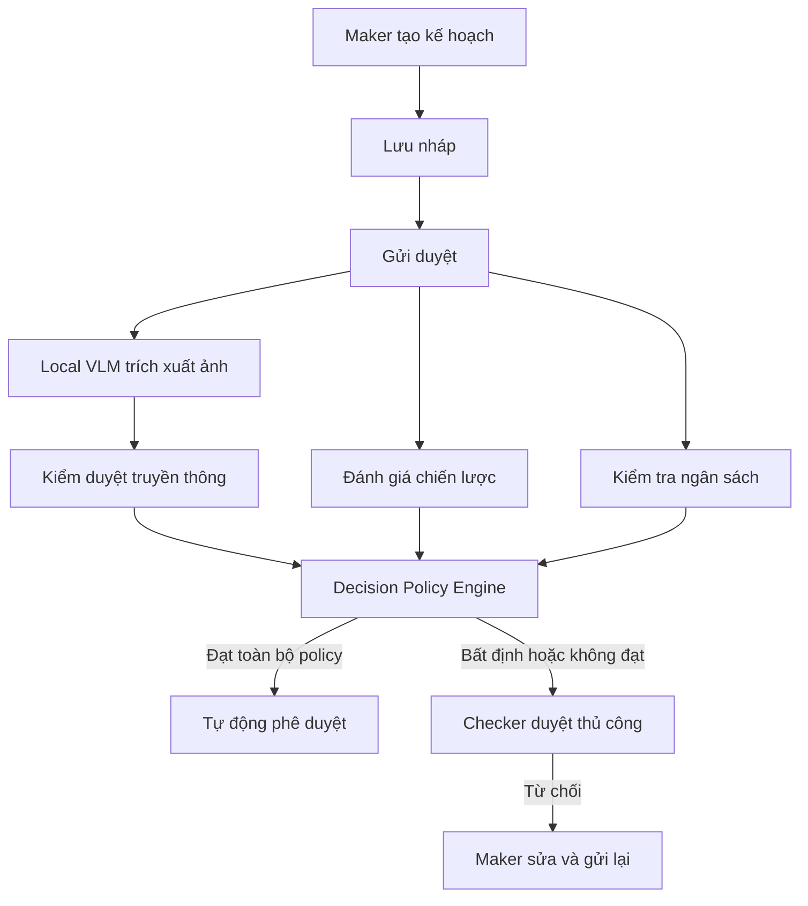

# CHIẾN LƯỢC TRIỂN KHAI SPRINT 1 TRONG 72 GIỜ BẰNG CODEX

## 1. Mục tiêu Sprint

Trong 72 giờ, hoàn thành một MVP có thể chạy và trình diễn end-to-end cho module **Phê duyệt kế hoạch marketing có hỗ trợ AI** theo luồng:



Kết quả bắt buộc:

- Ứng dụng khởi chạy được bằng hướng dẫn trong README.
- Có dữ liệu và tài khoản demo cho Maker, Checker và Administrator.
- Chạy được tối thiểu một kịch bản tự động phê duyệt.
- Chạy được tối thiểu một kịch bản chuyển Checker duyệt thủ công.
- Kế hoạch bị từ chối có thể chỉnh sửa và gửi lại thành phiên bản/vòng duyệt mới.
- Có kiểm thử cho các business rule quan trọng.
- Có audit log để giải thích quyết định của AI và Checker.

---

## 2. Nguyên tắc triển khai

1. Tập trung vào một vertical slice chạy xuyên suốt; không triển khai toàn bộ Product Scope Phase 1.
2. Tái sử dụng stack, convention và module hiện có trong repository.
3. Ưu tiên modular monolith; không tách microservice trong Sprint 1.
4. Local VLM chỉ trích xuất bằng chứng hình ảnh, không tự quyết định phê duyệt.
5. Kiểm tra ngân sách phải là deterministic rules engine.
6. AI không được tự động từ chối kế hoạch trong Sprint 1.
7. Agent lỗi, timeout, confidence thấp hoặc output sai schema đều chuyển Human Review.
8. Phân quyền phải được kiểm tra tại backend; ẩn nút trên UI không thay thế authorization.
9. Version, approval round và kết quả AI cũ không được ghi đè.
10. Sau giờ thứ 68 không bổ sung tính năng; chỉ sửa lỗi và chuẩn bị demo.

---

## 3. Phạm vi Sprint 1

### 3.1. Must-have

#### Core workflow

- Danh sách và chi tiết kế hoạch.
- Tạo kế hoạch và lưu nháp.
- Upload hình ảnh.
- Gửi phê duyệt.
- Validate trường bắt buộc, file và Checker.
- Khóa dữ liệu sau khi gửi.
- Tạo MarketingPlanVersion và ApprovalRound.
- Checker phê duyệt hoặc từ chối.
- Lý do từ chối bắt buộc.
- Maker sửa và gửi lại sau từ chối.
- Không cho Maker tự phê duyệt kế hoạch của mình.

#### AI pipeline

- Approval Orchestrator.
- Local VLM adapter.
- Mock VLM provider để bảo đảm demo khi model local không hoạt động.
- Trích xuất OCR, mô tả ảnh, đối tượng, chất lượng và confidence.
- Media Compliance Agent.
- Strategy Feasibility Agent.
- Budget Rules Engine.
- Decision Policy Engine.
- Chuyển `HUMAN_REVIEW_REQUIRED` khi không đủ điều kiện tự động duyệt.
- Lưu structured output của từng agent.

#### Checker review

Checker xem được:

- Nội dung kế hoạch và ảnh gốc.
- Nội dung Local VLM trích xuất.
- Evidence và confidence.
- Kết quả Media Compliance.
- Điểm khả thi theo từng tiêu chí.
- Kết quả kiểm tra ngân sách.
- Lý do kế hoạch không được tự động duyệt.
- Lịch sử và kết quả các vòng trước.

#### Audit tối thiểu

- Actor hoặc System thực hiện.
- Hành động và kết quả.
- Trạng thái trước/sau.
- Plan version và approval round.
- Model, agent và policy version.
- Score, confidence và evidence summary.
- Decision source: AI hoặc Checker.
- Input hash, thời gian xử lý và lỗi nếu có.

### 3.2. Should-have nếu còn thời gian

- SLA đơn giản theo số giờ liên tục.
- Notification in-app.
- Màn hình cấu hình ngưỡng AI.
- Màn hình cấu hình hạn mức ngân sách.
- Retry thủ công pipeline AI.
- Dashboard số liệu cơ bản.

### 3.3. Không triển khai trong Sprint 1

- Email thật.
- Quản lý nhân viên và tài khoản hoàn chỉnh.
- Reset password.
- Role builder động hoàn chỉnh.
- Lịch làm việc, ngày lễ và SLA phức tạp.
- Nhiều cấp hoặc phê duyệt song song.
- Ủy quyền phê duyệt.
- Dữ liệu thị trường thời gian thực.
- Model training hoặc online learning.
- Tự động từ chối bằng AI.
- Analytics nâng cao và export hàng loạt.
- Microservices, Kubernetes hoặc message broker mới nếu dự án chưa có.

---

## 4. Điều kiện tự động phê duyệt

```text
AUTO_APPROVE khi đồng thời thỏa mãn:

media_result = PASS
AND media_confidence >= 0.85
AND feasibility_score > 70
AND feasibility_confidence >= 0.80
AND budget <= applicable_budget_limit
AND hard_violation_count = 0
AND unresolved_conflict_count = 0
AND agent_error_count = 0
AND auto_approval_policy_enabled = true
AND plan_status = PENDING_APPROVAL
AND approval_round_status = ACTIVE
```

Các trường hợp còn lại chuyển `HUMAN_REVIEW_REQUIRED`. Điểm bằng đúng 70 không đủ điều kiện vì rule yêu cầu `> 70`.

---

## 5. Kiến trúc triển khai

```text
application/
├── plan-module/
├── approval-module/
├── ai-orchestrator/
│   ├── vlm-adapter/
│   ├── media-compliance/
│   ├── strategy-feasibility/
│   ├── budget-validator/
│   └── decision-policy/
├── audit-module/
├── notification-module/
└── shared/
```

Các agent là module có interface riêng trong cùng ứng dụng. Có thể tách thành service sau khi MVP chứng minh được tải, độ ổn định và nhu cầu scale.

### 5.1. Contract chung của agent

```json
{
  "run_id": "RUN-001",
  "plan_id": "MKT-2026-001",
  "version": 1,
  "approval_round": 1,
  "status": "SUCCEEDED",
  "score": 82,
  "confidence": 0.91,
  "hard_violations": [],
  "warnings": [],
  "evidence": [],
  "model_version": "local-vlm-version",
  "policy_version": "POLICY-1.0",
  "started_at": "",
  "completed_at": ""
}
```

Output sai schema, thiếu confidence, thiếu model version hoặc thiếu kết quả bắt buộc được xem là thất bại và chuyển Human Review.

### 5.2. Local VLM adapter

```text
VisualModelProvider
├── analyzeImage()
├── healthCheck()
└── getModelMetadata()

Implementations
├── LocalVLMProvider
└── MockVLMProvider
```

MockVLMProvider phải được seed ít nhất ba kịch bản:

1. Hình ảnh hợp lệ, confidence cao.
2. Hình ảnh có cảnh báo hoặc confidence thấp.
3. Provider lỗi/timeout.

---

## 6. Data model tối thiểu

```text
users
marketing_plans
marketing_plan_versions
attachments
approval_rounds
approval_decisions
ai_evaluation_runs
agent_executions
media_evaluation_results
strategy_evaluation_results
budget_validation_results
auto_approval_policies
budget_limits
activity_logs
notifications
```

### marketing_plans

```text
id
code
name
maker_id
checker_id
status
current_version
current_approval_round
processing_stage
created_at
updated_at
row_version
```

### approval_rounds

```text
id
plan_id
plan_version_id
round_number
checker_id
status
decision_source
sla_deadline
started_at
completed_at
```

### ai_evaluation_runs

```text
id
approval_round_id
correlation_id
status
policy_snapshot
input_hash
started_at
completed_at
failure_reason
```

### approval_decisions

```text
id
approval_round_id
decision
decision_source
actor_id
reason
ai_recommendation
override_reason
created_at
```

---

## 7. Work packages cho Codex

### WP1 – Repository audit

Codex chỉ đọc và báo cáo:

- Stack hiện tại.
- Cấu trúc frontend/backend.
- Authentication và authorization.
- Database, migration và seed mechanism.
- Module có thể tái sử dụng.
- Coding convention, test/lint/build command.
- Rủi ro, blocker và assumption.

Không sửa code ở WP1.

### WP2 – Domain foundation

- Entity và enum.
- Migration.
- Seed user/role/policy/budget.
- State transition service.
- Validation cơ bản.
- Repository/service layer theo convention hiện tại.

### WP3 – Core Maker–Checker

- CRUD kế hoạch.
- Upload hình ảnh.
- Submit.
- Tạo version và approval round.
- Khóa dữ liệu.
- Approve/reject/resubmit.
- Permission và self-approval protection.

### WP4 – AI pipeline

- Orchestrator.
- Agent schemas.
- Local/Mock VLM provider.
- Media Compliance Agent.
- Strategy Feasibility Agent.
- Budget Rules Engine.
- Timeout/error handling.

### WP5 – Decision và UI

- Decision Policy Engine.
- Auto-approval transaction.
- Human Review UI.
- Evidence/score/confidence display.
- Checker override có lý do.
- Audit và notification in-app.

### WP6 – Hardening và demo

- Integration tests.
- Concurrency và idempotency.
- Error states.
- Seed demo scenarios.
- README và demo checklist.
- Dọn warning/lint/build error.

---

## 8. Timeline 72 giờ

| Thời gian | Công việc | Exit criteria |
|---|---|---|
| 0–4 giờ | WP1: khảo sát repo và chốt kế hoạch | Có implementation plan và danh sách file/module |
| 4–10 giờ | WP2: schema, migration, seed, contract | Migration chạy; seed thành công |
| 10–20 giờ | Tạo, lưu nháp, danh sách, chi tiết, upload | Maker tạo/lưu được kế hoạch |
| 20–28 giờ | Submit, version, approval round, khóa dữ liệu | Gửi duyệt tạo V1/Round 1 |
| 28–40 giờ | VLM adapter và evaluation agents | Pipeline trả structured output |
| 40–48 giờ | Decision Policy Engine | Trả AUTO_APPROVE hoặc HUMAN_REVIEW_REQUIRED |
| 48–56 giờ | Checker review và gửi lại | Chạy được approve/reject/resubmit |
| 56–62 giờ | Audit, notification và error handling | Theo dõi được toàn bộ quyết định |
| 62–68 giờ | Integration test và sửa lỗi | Luồng end-to-end ổn định |
| 68–72 giờ | Seed demo, README, demo rehearsal | Có thể chạy và trình bày từ máy sạch |

### Checkpoint bắt buộc

- Giờ 20: tạo và lưu được kế hoạch.
- Giờ 28: gửi duyệt và tạo version/vòng duyệt.
- Giờ 48: pipeline đưa ra được quyết định.
- Giờ 62: Maker → AI → Checker → Maker chạy xuyên suốt.
- Giờ 68: đóng scope; không thêm tính năng.

---

## 9. Test case bắt buộc

1. Maker lưu được bản nháp thiếu dữ liệu.
2. Không gửi được khi thiếu trường, file hoặc Checker.
3. Maker không thể tự làm Checker.
4. Sau khi gửi, dữ liệu và file bị khóa.
5. Gửi lần đầu tạo V1/Round 1.
6. Media PASS, feasibility 71, đủ confidence và đủ ngân sách thì tự duyệt.
7. Feasibility bằng 70 thì không tự duyệt.
8. Ngân sách bằng hạn mức vẫn hợp lệ.
9. Ngân sách vượt hạn mức thì chuyển Human Review.
10. VLM confidence thấp thì chuyển Human Review.
11. Agent timeout hoặc output sai schema thì chuyển Human Review.
12. Hard violation thì chuyển Human Review.
13. Checker từ chối thiếu lý do thì bị chặn.
14. Maker sửa và gửi lại tạo V2/Round 2.
15. Kết quả AI của V1 không bị ghi đè bởi V2.
16. Hai request quyết định đồng thời chỉ có một request thành công.
17. Checker override khuyến nghị AI phải nhập lý do.
18. Retry pipeline không tạo decision hoặc notification trùng.

---

## 10. Definition of Done

Một work package chỉ hoàn thành khi:

- Code tuân thủ convention của repository.
- Không làm thay đổi ngoài phạm vi mà chưa giải thích.
- Migration/seed liên quan chạy thành công.
- Build và lint liên quan thành công.
- Unit/integration test liên quan thành công.
- Error state được xử lý.
- Permission backend được kiểm tra.
- Không ghi đè version/audit cũ.
- README hoặc tài liệu kỹ thuật được cập nhật nếu cách chạy thay đổi.
- Codex báo cáo file đã sửa, lệnh đã chạy, test result và phần còn thiếu.

---

## 11. Quy tắc làm việc để tránh xung đột

- Mỗi work package có phạm vi file/module rõ ràng.
- Không để hai agent chỉnh cùng file tại cùng thời điểm.
- Migration được tạo tuần tự và có một người/agent chịu trách nhiệm.
- Contract dùng chung phải chốt trước khi frontend, backend và AI làm song song.
- Thay đổi API/schema phải thông báo cho các phần phụ thuộc.
- Không refactor diện rộng trong Sprint 1.
- Không đổi formatter, package manager hoặc cấu trúc repository nếu không phải blocker.
- Mọi assumption phải ghi trong implementation plan.

---

## 12. Master prompt cho Codex

```text
Bạn đang triển khai Sprint 1 trong tối đa 72 giờ cho module
“Phê duyệt kế hoạch marketing có hỗ trợ AI”.

Nguồn yêu cầu:
- docs/scope-phe-duyet-ke-hoach-marketing-phase-1.md
- docs/chien-luoc-codex-sprint-1-72h.md
- AGENTS.md
- Các skill trong .agents/skills

Mục tiêu Sprint:
Hoàn thành một vertical slice chạy được:

Maker tạo kế hoạch
→ lưu nháp
→ upload hình ảnh
→ gửi duyệt
→ tạo version và approval round
→ Local VLM trích xuất hình ảnh
→ Media Compliance Agent kiểm tra nội dung
→ Strategy Feasibility Agent chấm điểm
→ Budget Rules Engine kiểm tra hạn mức
→ Decision Policy Engine tự động duyệt hoặc chuyển Human Review
→ Checker phê duyệt/từ chối
→ Maker chỉnh sửa và gửi lại sau từ chối.

Ràng buộc:

1. Đọc toàn bộ AGENTS.md, scope và chiến lược Sprint trước khi hành động.
2. Kiểm tra skill trong .agents/skills và dùng skill phù hợp.
3. Khảo sát codebase và tái sử dụng stack/kiến trúc hiện có.
4. Không thay đổi stack nếu codebase đã có lựa chọn hợp lệ.
5. Ưu tiên modular monolith; không tạo microservice không cần thiết.
6. Không triển khai toàn bộ Product Scope; chỉ triển khai Sprint 1 scope.
7. Không tự động từ chối dựa trên AI.
8. Agent lỗi, timeout, confidence thấp hoặc output không hợp lệ phải
   chuyển HUMAN_REVIEW_REQUIRED.
9. Kiểm tra ngân sách phải là deterministic rules engine.
10. Local VLM chỉ trích xuất bằng chứng, không quyết định phê duyệt.
11. Mọi agent phải trả structured output theo schema.
12. Phải có MockVLMProvider để demo không phụ thuộc phần cứng.
13. Quyền phải được kiểm tra ở backend.
14. Quyết định phải idempotent và chống xử lý đồng thời.
15. Không ghi đè version, approval round hoặc kết quả AI cũ.
16. Mọi assumption phải ghi rõ; không tự bịa nghiệp vụ.
17. Không sửa file ngoài phạm vi khi chưa giải thích.
18. Không thêm tính năng Should/Could trước khi luồng Must chạy ổn định.

Điều kiện auto-approve:

- Media Compliance = PASS.
- Không có hard violation.
- VLM confidence >= 0.85.
- Feasibility score > 70.
- Strategy confidence >= 0.80.
- Budget <= hạn mức.
- Không có agent lỗi, timeout hoặc output thiếu.
- Auto-approval policy đang bật.
- Kế hoạch vẫn PENDING_APPROVAL.
- Approval round hiện tại vẫn ACTIVE.

Bước đầu tiên:

1. Chỉ khảo sát repository; chưa sửa code.
2. Báo cáo stack, cấu trúc, module tái sử dụng và blocker.
3. Tạo implementation plan theo WP1–WP6.
4. Liệt kê file/module dự kiến sửa.
5. Đề xuất database migration và API contract.
6. Liệt kê assumption, rủi ro và test plan.
7. Dừng để tôi xác nhận trước khi triển khai.

Sau khi được xác nhận:

- Triển khai lần lượt từng work package.
- Sau mỗi work package, chạy build/test/lint liên quan.
- Báo cáo file đã thay đổi, lệnh và kết quả test.
- Nếu Local VLM là blocker, dùng adapter/mock để giữ luồng chạy được.
- Không mở rộng scope để xử lý một lỗi cục bộ.
- Sau giờ thứ 68 chỉ sửa lỗi, hoàn thiện seed, README và demo.
```

---

## 13. Demo checklist

### Kịch bản 1 – Tự động phê duyệt

- Maker tạo kế hoạch hợp lệ.
- Upload ảnh mock PASS.
- Điểm khả thi trên 70 và confidence đạt ngưỡng.
- Ngân sách không vượt hạn mức.
- Hệ thống tự động chuyển sang Đã duyệt.
- Audit thể hiện nguồn quyết định `AI_AUTO_APPROVAL`.

### Kịch bản 2 – Chuyển Checker

- Maker gửi kế hoạch có confidence thấp hoặc cảnh báo truyền thông.
- Hệ thống chuyển `HUMAN_REVIEW_REQUIRED`.
- Checker xem được lý do và evidence.
- Checker phê duyệt hoặc từ chối.

### Kịch bản 3 – Từ chối và gửi lại

- Checker từ chối và nhập lý do.
- Maker xem lý do, sửa nội dung/file và gửi lại.
- Hệ thống tạo V2/Round 2 và pipeline mới.
- V1/Round 1 cùng kết quả AI cũ vẫn truy cập được.

### Kịch bản 4 – Pipeline lỗi

- Mock provider trả timeout hoặc output lỗi.
- Kế hoạch không bị rollback và không bị tự động từ chối.
- Checker nhận hồ sơ Human Review.
- Audit lưu failure reason và correlation ID.

---

## 14. Kết luận

Sprint 1 không nhằm hoàn thiện toàn bộ nền tảng production. Sprint phải chứng minh chắc chắn ba năng lực:

1. Pipeline AI xử lý được kế hoạch và hình ảnh theo structured contract.
2. Decision Policy Engine áp dụng đúng policy tự động phê duyệt.
3. Con người vẫn kiểm soát các trường hợp bất định, lỗi và vi phạm.

Nếu ba năng lực này chạy ổn định, các module SLA nâng cao, quản trị nhân sự, email, dashboard và scale service có thể tiếp tục ở Sprint sau mà không phải thay đổi luồng nghiệp vụ cốt lõi.
